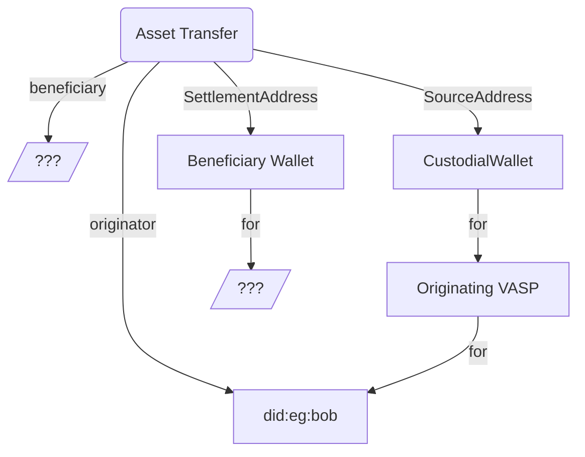
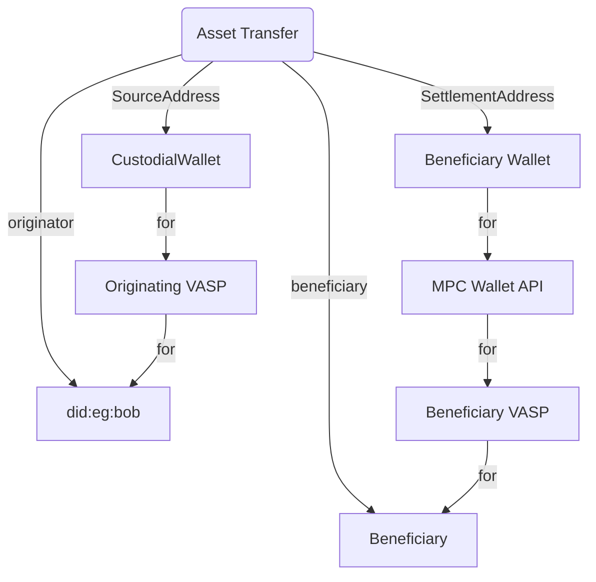
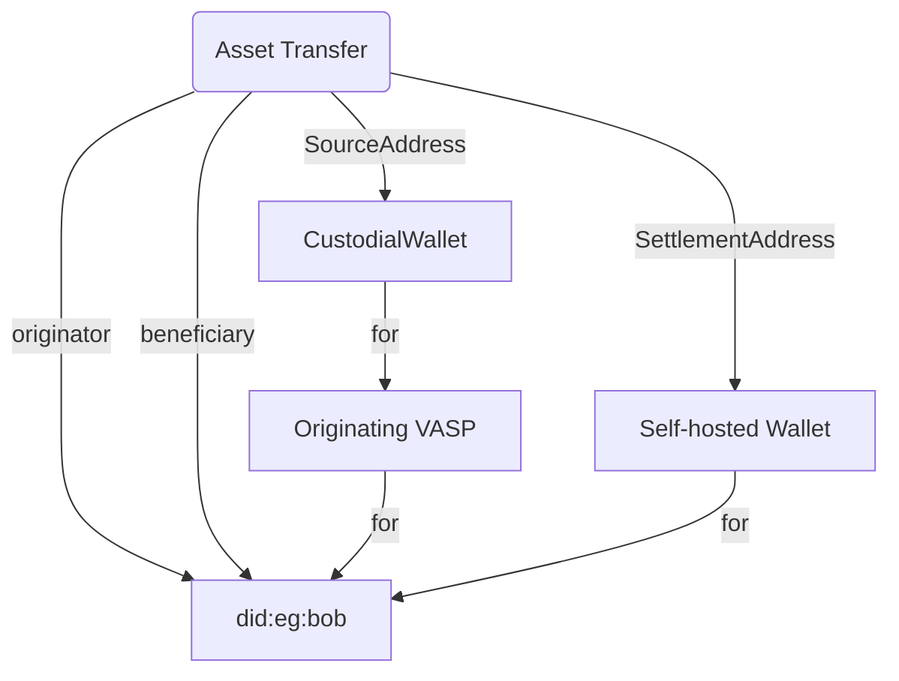

<!--You can leave these HTML comments in your merged EIP and delete the visible duplicate text guides, they will not appear and may be helpful to refer to if you edit it again. This is the suggested template for new EIPs. Note that an EIP number will be assigned by an editor. When opening a pull request to submit your EIP, please use an abbreviated title in the filename, `eip-draft_title_abbrev.md`. The title should be 44 characters or less.-->

## Simple Summary

<!--"If you can't explain it simply, you don't understand it well enough." Provide a simplified and layman-accessible explanation of the TAIP.-->

Agents are services involved in executing transactions. They can be commercial
services such as exchanges and custodial wallet services. They could also be
wallets, blockchain addresses, DeFi Protocols, bridges, and other services
directly involved in a transaction.

## Abstract

<!--A short (~200 word) description of the technical issue being addressed.-->

This specification defines how agents can represent themselves in a
[Transaction Authorization Protocol Flow][TAIP-4], update details about
themselves, and interact implemented using a small set of TAIP-2
Messages][TAIP-2] between each other.

Agents can be centralized services, software applications running on end-user
devices, or decentralized protocols such as DEXes and Bridges.

## Motivation

<!--The motivation is critical for TAIP. It should clearly explain why the state of the art is inadequate to address the problem that the TAIP solves. TAIP submissions without sufficient motivation may be rejected outright.-->

Traditional payment authorization protocols such as [ISO-20022] or [ISO-8583]
only support centralized financial institutions as agents and must work better
with self-hosted or decentralized participants.

For virtual asset transactions to truly become a core part of the world's
financial infrastructure, all three types of agents can participate equally in
the authorization flow of a transaction.

## Specification

### Representing Agents

Agents are identified using [Decentralized Identifiers (DIDs)][DID]. These
identifiers have specific properties of being created by the Agent and support
both authenticated and end-to-end encryption. DIDs can equally identify
centralized and blockchain-native services such as wallets and DeFi protocols.
Agents are represented in TAP in straightforward JSON-LD node syntax:

```json
{
  "@id": "did:web:vasp.com"
}
```

The following example shows its use in a [TAIP-3] message:

```json
{
  "from": "did:web:originator.sample",
  "type": "https://tap.rsvp/schema/1.0#Transfer",
  "id": "...",
  "to": ["did:pkh:eip155:1:0x1234a96D359eC26a11e2C2b3d8f8B8942d5Bfcdb"],
  "body": {
    "@context": "https://tap.rsvp/schema/1.0",
    "@type": "https://tap.rsvp/schema/1.0#Transfer",
    "asset": "eip155:1/slip44:60",
    "originator": {
      "@id": "did:web:originator.sample"
    },
    "amountSubunits": "1230000000000000000",
    "agents": [
      {
        "@id": "did:web:originator.sample"
      },
      {
        "@id": "did:pkh:eip155:1:0x1234a96D359eC26a11e2C2b3d8f8B8942d5Bfcdb",
        "role": "SettlementAddress",
        "for": "did:web:originator.sample"
      }
    ]
  }
}
```

The following are the attributes of an object in the `agents` array:

- `@id` - REQUIRED the [DID] of the Agent
- `role` - OPTIONAL a string or an array of strings as specified for the
  particular kind of transaction. Eg. `SettlementAddress` for [TAIP-3]
- `for` - OPTIONAL a [DID] of another Agent or Party that this agent acts on
  behalf of in this transaction.
- `policies` - OPTIONAL an array of [TAIP-7 Policies][TAIP-7]

Future TAIPs are encouraged to extend the agent model with additional
functionality.

### Agent Interaction Types

There are three primary ways of interacting with agents:

- Centralized Agents, who can interact in real-time with
  [TAIP-2 DIDComm Messages][TAIP-2] through a server endpoint defined in the
  [DIDComm Transports][DIDCommTransports]
- End-user-controlled software, such as self-hosted wallets, can receive
  [TAIP-2 DIDComm Messages][TAIP-2] in an interactive User Interface using
  [DIDComm Out of Band][DIDCommOOB]
- Decentralized Protocol agents, such as DeFi protocols that can only
  communicate through blockchain transactions, possibly through an
  implementation of [CAIP-74]

### Identifying Agents

DID Methods, implement different ways of creating and modifying Decentralized
Identifiers. The recommendation is to use the following two DID Methods:

- [WEB-DID] For centralized services, allowing them to be identified by their
  domain name.
- [PKH-DID] For agent identified by a [CAIP-10] blockchain address. For example,
  these could be both self-hosted and custodial wallets but also allow us to
  identify DeFi protocols.

### Web DID for Centralized Services

Centralized Agents creating DIDs and implementing TAP SHOULD create a [WEB-DID]
containing the following required sections in the
[DIDDoc](https://www.w3.org/TR/did-core/#dfn-did-documents):

- [service containing a DID endpoint](https://www.w3.org/TR/did-core/#dfn-service)
- [verificationMethod section containing public keys used for validating DIDComm message signatures](https://www.w3.org/TR/did-core/#verification-methods)
- [keyAgreement section containing public keys used for encrypted DIDComm messages](https://www.w3.org/TR/did-core/#key-agreement)

### PKH-DID's for Blockchain addresses

Since every wallet address has a blockchain account address, self-hosted wallets
should be represented as a
[PKH DID](https://github.com/w3c-ccg/did-pkh/blob/main/did-pkh-method-draft.md)
using [CAIP-10](https://chainagnostic.org/CAIPs/caip-10) identifiers.

For example, the Ethereum address can be represented as:

```json
{
  "@id": "did:pkh:eip155:1:0xab16a96D359eC26a11e2C2b3d8f8B8942d5Bfcdb"
}
```

### Roles

Different agents can have specific roles specific to a particular transaction
type. For example `settlementAddress` is a role in a [TAIP-3] message indicating
how a transaction should be settled.

```json
{
  "@id": "did:pkh:eip155:1:0x1234a96D359eC26a11e2C2b3d8f8B8942d5Bfcdb",
  "role": "settlementAddress"
}
```

### Transaction Graphs

An essential aspect of managing risk in a transaction is to identify the various
participants in a transaction. Agents typically act on behalf of another
identity.

A transaction’s participants can be presented as the following graph of control,
showing various missing vital pieces of information the Originating VASP’s risk
department needs to discover, in particular, who is the beneficiary and who
controls the Settlement Address:



After discovering more about the Asset Transfer, we found it is a transaction to
a third-party beneficiary at another exchange using a wallet API service. The
graph looks like this, and we can manage risk better:



If we instead discovered that the transaction was a withdrawal to our customer's
self-hosted wallet, the control graph would look like this:



One of the primary jobs of [TAP][TAIP-4] is to discover and identify the various
controllers behind the parties and agents involved in a transaction to manage
risk regarding them and ensure that the correct beneficiary receives a
transaction.

### Policies

Each agent can declare policies about different requirements that they need
fulfilled to be able authorize a transaction. See [TAIP-7] for more.

### Agent meta data messages

In parallel with the [Authorization Flow][TAIP-4], agents can send [TAIP-2]
messages to other participants to provide or prove additional details about
themselves or other participants. The messages allow agents to collaborate to
fulfill each other's policies so they can successfully and swiftly authorize a
transaction.

Please note that, like any [TAIP-2] messages, these are just messages sent by an
agent. For security purposes, a receiving Agent MUST determine if they can trust
the sender for the information provided.

Any Agent can send one of the following messages:

- `AddAgents` - Adds one or more additional agents to the transaction
- `ReplaceAgent` - Replace an agent with another agent
- `RemoveAgent` - Removes an agent from transaction

#### AddAgents

Any agent can add additional agents to a transaction by replying as a thread to
the initial message. The following shows the attributes of the `body` object:

- `@context` - REQUIRED the JSON-LD context `https://tap.rsvp/schema/1.0`
  (provisional)
- `@type` - REQUIRED the JSON-LD type `https://tap.rsvp/schema/1.0#AddAgents`
  (provisional)
- `agents` - REQUIRED an array of Agents to add to the transactions Agents list

If an existing transaction agent is included in the list of `agents`, an Agent
SHOULD update their internal record for this Agent with any additional data
provided in this message.

Any new agents added should be included in the recipient list of the message.

#### ReplaceAgent

Any agent can replace themselves in a transaction by replying to the initial
message as a thread. The following shows the attributes of the `body` object:

- `@context` - REQUIRED the JSON-LD context `https://tap.rsvp/schema/1.0`
  (provisional)
- `@type` - REQUIRED the JSON-LD type `https://tap.rsvp/schema/1.0#ReplaceAgent`
  (provisional)
- `original` - REQUIRED the [DID] of the Agent to be replaced
- `replacement` - REQUIRED an Agent to add to the transactions Agents list

If a receiving Agent does not have a record for the Agent specified in the
`original`, it SHOULD ignore this message.

The message's sender SHOULD include the Agent specified in the `original` on the
recipient list so they can maintain a record that they are no longer part of
this transaction.

#### RemoveAgent

Any agent can propose removing another agent from the transaction by replying as
a thread to the initial message. The following shows the attributes of the
`body` object:

- `@context` - REQUIRED the JSON-LD context `https://tap.rsvp/schema/1.0`
  (provisional)
- `@type` - REQUIRED the JSON-LD type `https://tap.rsvp/schema/1.0#RemoveAgent`
  (provisional)
- `agent` - REQUIRED the [DID] of the Agent to be removed

If a receiving Agent does not have a record for the Agent specified in the agent
`agent` attribute, it SHOULD ignore this message.

The message's sender SHOULD include the Agent specified in `agent` on the
recipient list so they can maintain a record that they are no longer part of
this transaction.

## Rationale

An end-user may request a transaction with fairly minimal information about its
participants. The end-user's Agent must fill out the list of agents to manage
risk on behalf of themselves and their customers.

The Agent structure provides an abstract method for multiple types of agents to
collaborate to discover the required information to authorize a transaction
using [TAIP-4].

## Test Cases

Provide here any test cases that will help implementers of the TAIP to validate
their implementation.

### DID Documents

The following is an example DID Document that could be created by a centralized
service such as an exchange:

```json
{
  "did": "did:web:example.com",
  "verificationMethod": [
    {
      "id": "did:web:example.com#key-1",
      "type": "Ed25519VerificationKey2020",
      "controller": "did:web:example.com",
      "publicKeyMultibase": "zH3C2AVvLMv6gmMNam3uVAjZpfkcJCwDwnZn6z3wXmqPV"
    }
  ],
  "keyAgreement": [
    {
      "id": "did:example:example.com#key-x25519-1",
      "type": "JsonWebKey2020",
      "controller": "did:example:example.com",
      "publicKeyJwk": {
        "kty": "OKP",
        "crv": "X25519",
        "x": "avH0O2Y4tqLAq8y9zpianr8ajii5m4F_mICrzNlatXs"
      }
    }
  ],
  "service": [
    {
      "id": "did:web:tap.rsvp#tap",
      "type": "DIDCommMessaging",
      "serviceEndpoint": {
        "uri": "https://tap.rsvp/didcomm"
      }
    }
  ]
}
```

### TAIP-3 Asset Transfers

#### Missing Nodes

See the following [TAIP-3] message outlining a typical Asset Transfer where a
customer is asking to transfer funds to a blockchain address:

```json
{
  "from": "did:web:originator.vasp",
  "type": "https://tap.rsvp/schema/1.0#Transfer",
  "id": "...",
  "to": [
    "did:web:beneficiary.vasp",
    "did:pkh:eip155:1:0x1234a96D359eC26a11e2C2b3d8f8B8942d5Bfcdb"
  ],
  "body": {
    "@context": "https://tap.rsvp/schema/1.0",
    "@type": "https://tap.rsvp/schema/1.0#Transfer",
    "originator": {
      "@id": "did:eg:bob"
    },
    "asset": "eip155:1/slip44:60",
    "amountSubunits": "1230000000000000000",
    "settlementId": "eip155:1:tx/0x3edb98c24d46d148eb926c714f4fbaa117c47b0c0821f38bfce9763604457c33",
    "agents": [
      {
        "@id": "did:web:originator.vasp",
        "for": "did:eg:bob"
      },
      {
        "@id": "did:pkh:eip155:1:0x1234a96D359eC26a11e2C2b3d8f8B8942d5Bfcdb",
        "role": "SettlementAddress"
      }
    ]
  }
}
```

#### Complete example showing VASP to VASP third party Asset Transfer

After completing the discovery aspects of TAP the Asset Transfer could look like
this with a third party beneficiary and a VASP controlling the Settlement
Address:

```json
{
  "from": "did:web:originator.vasp",
  "type": "https://tap.rsvp/schema/1.0#Transfer",
  "id": "...",
  "to": [
    "did:web:beneficiary.vasp",
    "did:pkh:eip155:1:0x1234a96D359eC26a11e2C2b3d8f8B8942d5Bfcdb"
  ],
  "body": {
    "@context": "https://tap.rsvp/schema/1.0",
    "@type": "https://tap.rsvp/schema/1.0#Transfer",
    "originator": {
      "@id": "did:eg:bob"
    },
    "beneficiary": {
      "@id": "did:eg:alice"
    },
    "asset": "eip155:1/slip44:60",
    "amountSubunits": "1230000000000000000",
    "settlementId": "eip155:1:tx/0x3edb98c24d46d148eb926c714f4fbaa117c47b0c0821f38bfce9763604457c33",
    "agents": [
      {
        "@id": "did:pkh:eip155:1:0xabcda96D359eC26a11e2C2b3d8f8B8942d5Bfcdb",
        "for": "did:web:originator.vasp",
        "role": "SourceAddress"
      },
      {
        "@id": "did:web:originator.vasp",
        "for": "did:eg:bob"
      },
      {
        "@id": "did:web:beneficiary.vasp",
        "for": "did:eg:alice"
      },
      {
        "@id": "did:web:walletapi.sample",
        "for": "did:web:beneficiary.vasp"
      },
      {
        "@id": "did:pkh:eip155:1:0x1234a96D359eC26a11e2C2b3d8f8B8942d5Bfcdb",
        "for": "did:web:walletapi.sample",
        "role": "SettlementAddress"
      }
    ]
  }
}
```

#### Complete example showing VASP to first party self-hosted wallet Asset Transfer

After completing the discovery aspects of TAP we discover the Asset Transfer
goes to the customer's own self-hosted wallet address:

```json
{
  "from": "did:web:originator.vasp",
  "type": "https://tap.rsvp/schema/1.0#Transfer",
  "id": "...",
  "to": [
    "did:web:beneficiary.vasp",
    "did:pkh:eip155:1:0x1234a96D359eC26a11e2C2b3d8f8B8942d5Bfcdb"
  ],
  "body": {
    "@context": "https://tap.rsvp/schema/1.0",
    "@type": "https://tap.rsvp/schema/1.0#Transfer",
    "originator": {
      "@id": "did:eg:bob"
    },
    "beneficiary": {
      "@id": "did:eg:bob"
    },
    "asset": "eip155:1/slip44:60",
    "amountSubunits": "1230000000000000000",
    "settlementId": "eip155:1:tx/0x3edb98c24d46d148eb926c714f4fbaa117c47b0c0821f38bfce9763604457c33",
    "agents": [
      {
        "@id": "did:pkh:eip155:1:0xabcda96D359eC26a11e2C2b3d8f8B8942d5Bfcdb",
        "for": "did:web:originator.vasp",
        "role": "SourceAddress"
      },
      {
        "@id": "did:web:originator.vasp",
        "for": "did:eg:bob"
      },
      {
        "@id": "did:pkh:eip155:1:0x1234a96D359eC26a11e2C2b3d8f8B8942d5Bfcdb",
        "for": "did:eg:bob",
        "role": "SettlementAddress"
      }
    ]
  }
}
```

### Agent Meta Data Messages

The following are example plaintext messages. See [TAIP-2] for how to sign the
messages.

#### AddAgents

```json
{
  "from": "did:web:beneficiary.vasp",
  "type": "https://tap.rsvp/schema/1.0#AddAgents",
  "thid": "ID of transfer request",
  "to": ["did:web:originator.vasp"],
  "body": {
    "@context": "https://tap.rsvp/schema/1.0",
    "@type": "https://tap.rsvp/schema/1.0#AddAgents",
    "agents": [
      {
        "@id": "did:web:originator.vasp",
        "for": "did:eg:bob"
      },
      {
        "@id": "did:pkh:eip155:1:0x1234a96D359eC26a11e2C2b3d8f8B8942d5Bfcdb",
        "for": "did:eg:bob",
        "role": "SettlementAddress"
      }
    ]
  }
}
```

#### ReplaceAgent

```json
{
  "from": "did:web:beneficiary.vasp",
  "type": "https://tap.rsvp/schema/1.0#ReplaceAgent",
  "thid": "ID of transfer request",
  "to": ["did:web:originator.vasp"],
  "body": {
    "@context": "https://tap.rsvp/schema/1.0",
    "@type": "https://tap.rsvp/schema/1.0#ReplaceAgent",
    "original": "did:web:originator.vasp",
    "replacement": {
      "@id": "did:pkh:eip155:1:0x1234a96D359eC26a11e2C2b3d8f8B8942d5Bfcdb",
      "for": "did:eg:bob",
      "role": "SettlementAddress"
    }
  }
}
```

#### RemoveAgent

```json
{
  "from": "did:web:beneficiary.vasp",
  "type": "https://tap.rsvp/schema/1.0#RemoveAgent",
  "thid": "ID of transfer request",
  "to": ["did:web:originator.vasp"],
  "body": {
    "@context": "https://tap.rsvp/schema/1.0",
    "@type": "https://tap.rsvp/schema/1.0#RemoveAgent",
    "agent": "did:web:originator.vasp"
  }
}
```

## Security Considerations

<!--Please add an explicit list of intra-actor assumptions and known risk factors if applicable. Any normative definition of an interface requires these to be implementable; assumptions and risks should be at both individual interaction/use-case scale and systemically, should the interface specified gain ecosystem-namespace adoption. -->

As in any decentralized messaging protocol, it is paramount that the recipient
of messages trust the senders in the context of a particular transaction.

TODO specify in more detail

## Privacy Considerations

<!--Please add an explicit list of intra-actor assumptions and known risk factors if applicable. Any normative definition of an interface requires these to be implementable; assumptions and risks should be at both individual interaction/use-case scale and systemically, should the interface specified gain ecosystem-namespace adoption. -->

## References

<!--Links to external resources that help understanding the TAIP better. This can e.g. be links to existing implementations. See CONTRIBUTING.md#style-guide . -->

- [TAIP-2] Defines the TAP Message structure
- [TAIP-3] Asset Transfer Message
- [TAIP-4] Transaction Authorization Protocol
- [TAIP-6] Transaction Parties
- [TAIP-7] Policies
- [CAIP-10] Describes chainagnostic Account ID Specification
- [CAIP-74] CACAO
- [ISO-20022] ISO-20022 Universal Financial Industry message scheme
- [ISO-8583] ISO-8683 Financial-transaction-card-originated messages
- [DID] W3C Decentralized Identifiers
- [DIDComm] DIDComm Messaging
- [DIDCommTransports] DIDComm Transports
- [DIDCommOOB] DIDComm Out-of-Band
- [PKH-DID] `did:pkh` specification
- [WEB-DID] `did:web` specification

[TAIP-2]: ./taip-2
[TAIP-3]: ./taip-3
[TAIP-4]: ./taip-4
[TAIP-6]: ./taip-6
[TAIP-7]: ./taip-7
[DID]: https://www.w3.org/TR/did-core/
[DIDComm]: https://identity.foundation/didcomm-messaging/spec/v2.1/
[DIDCommTransports]: <https://identity.foundation/didcomm-messaging/spec/v2.1/#transports>
[DIDCommOOB]: <https://identity.foundation/didcomm-messaging/spec/v2.1/#out-of-band-messages>
[PKH-DID]: <https://github.com/w3c-ccg/did-pkh/blob/main/did-pkh-method-draft.md>
[WEB-DID]: <https://www.w3.org/did-method-web/>
[ISO-20022]: <https://www.iso20022.org>
[ISO-8583]: <https://en.wikipedia.org/wiki/ISO_8583>
[CAIP-10]: <https://chainagnostic.org/CAIPs/caip-10>
[CAIP-74]: <https://chainagnostic.org/CAIPs/caip-74>

## Copyright

Copyright and related rights waived via [CC0](../LICENSE).
