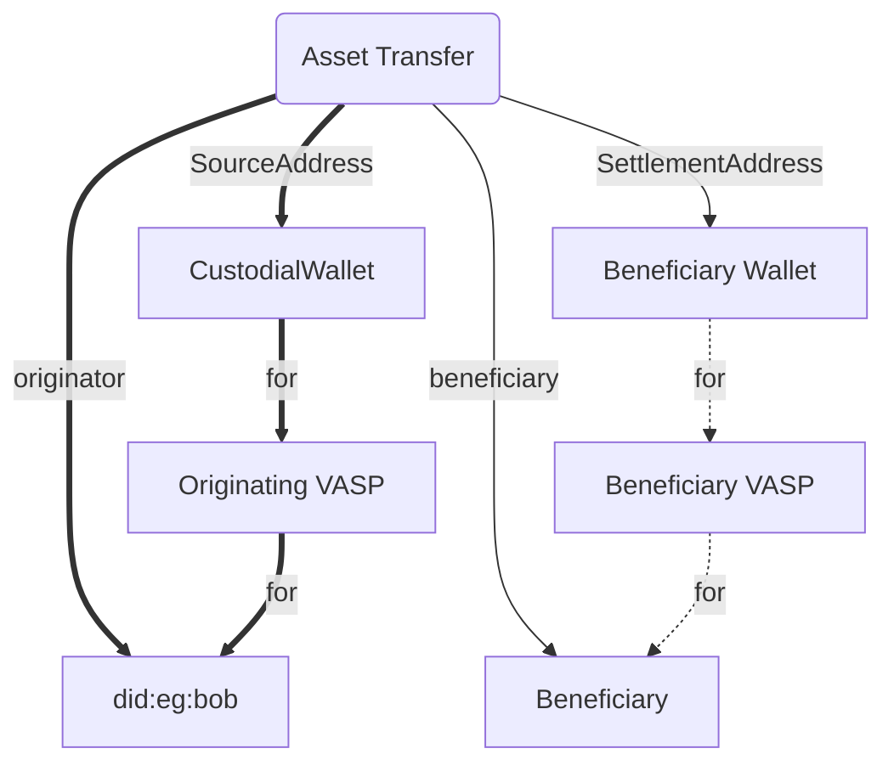
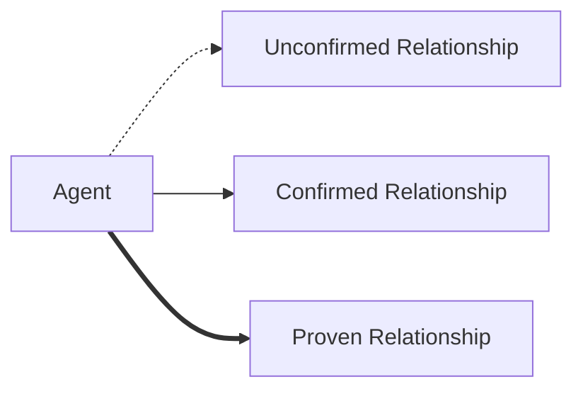
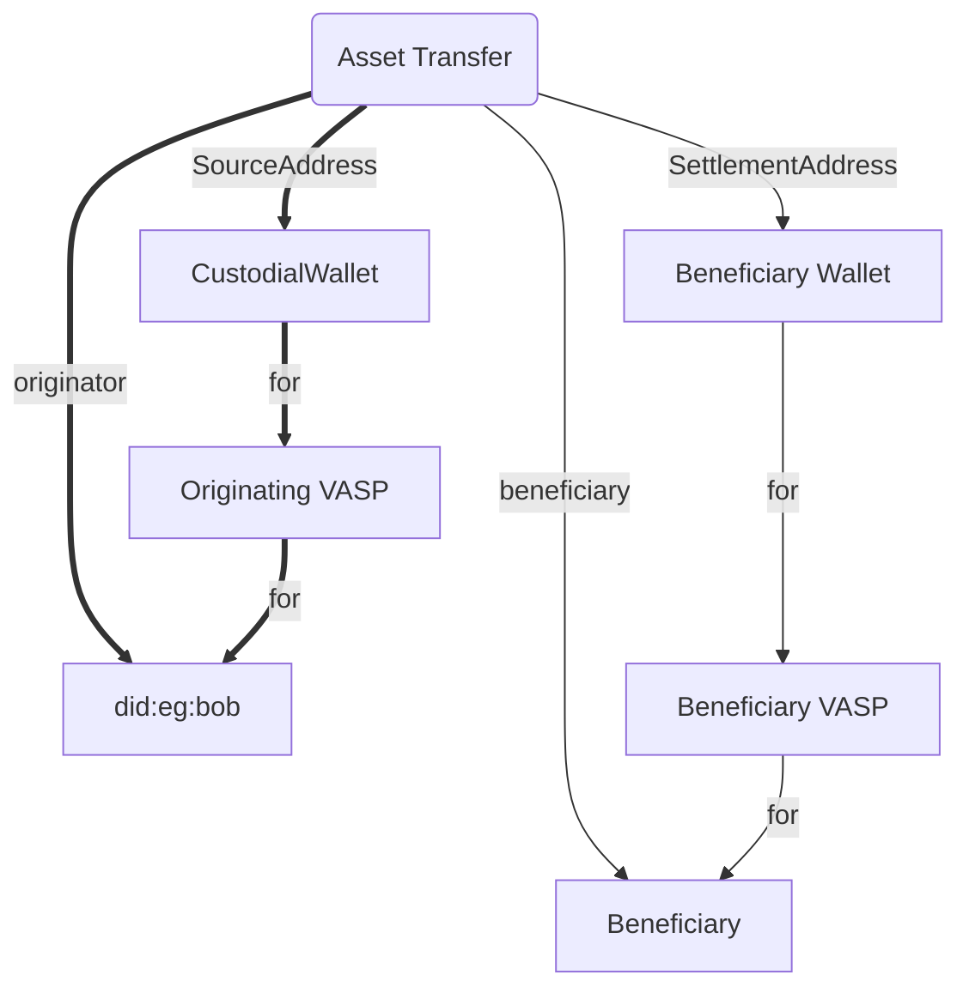
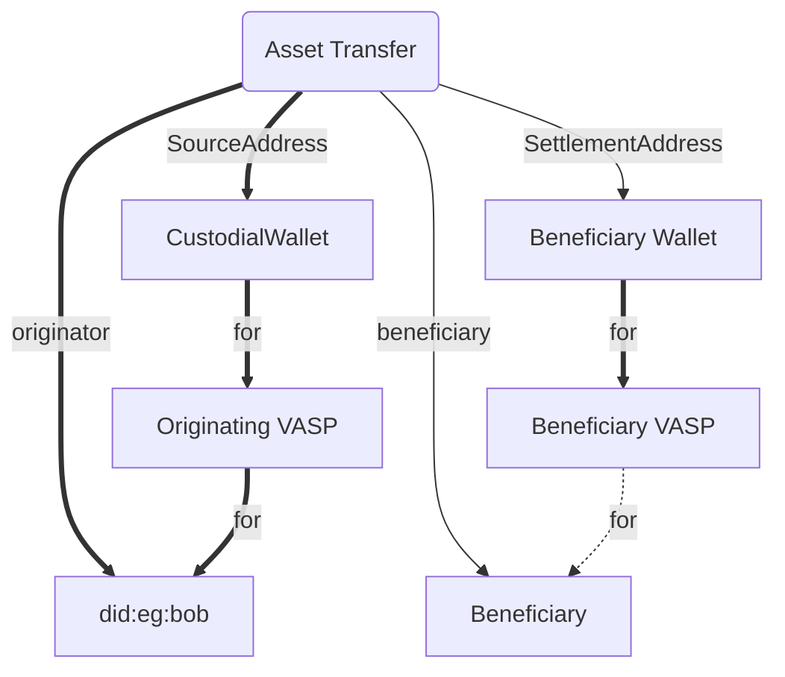
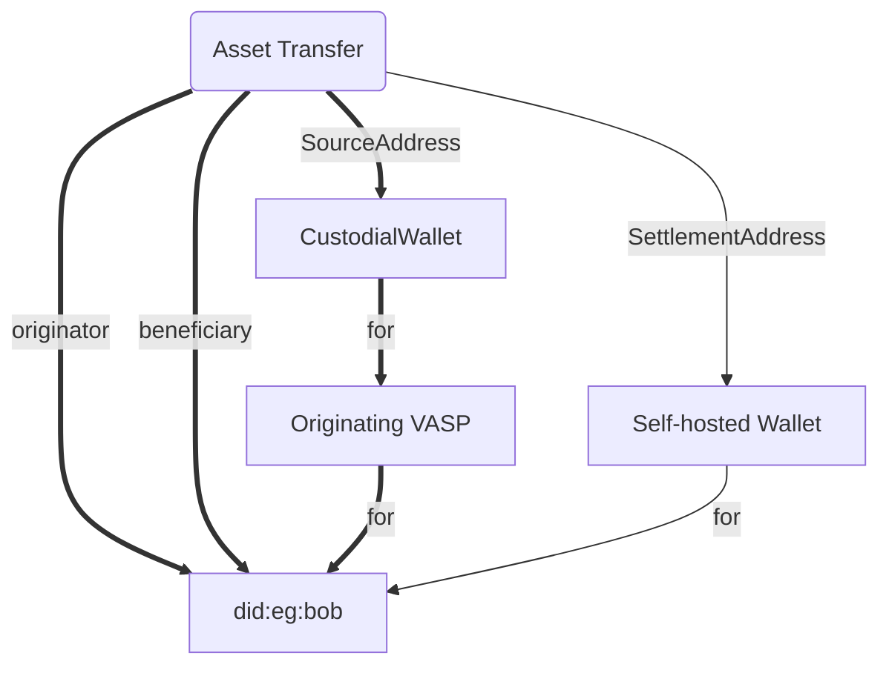
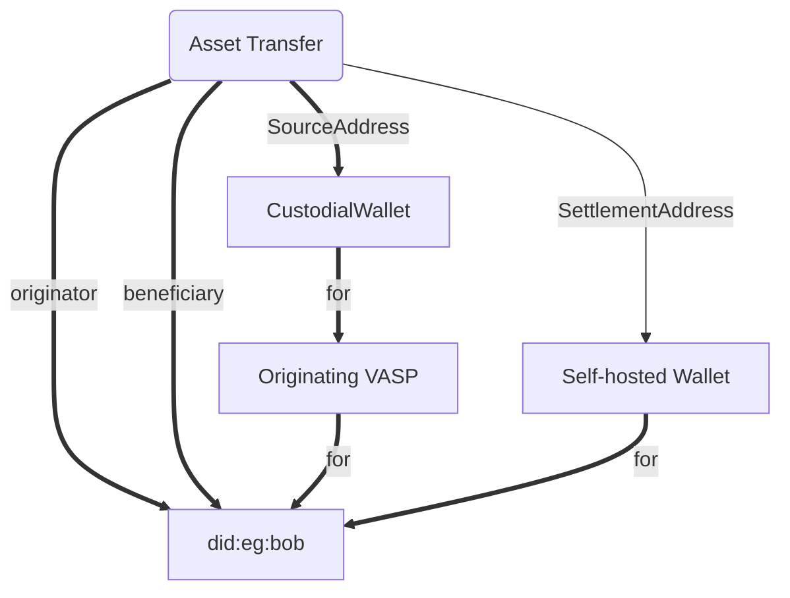

<!--You can leave these HTML comments in your merged EIP and delete the visible duplicate text guides, they will not appear and may be helpful to refer to if you edit it again. This is the suggested template for new EIPs. Note that an EIP number will be assigned by an editor. When opening a pull request to submit your EIP, please use an abbreviated title in the filename, `eip-draft_title_abbrev.md`. The title should be 44 characters or less.-->

## Simple Summary

<!--"If you can't explain it simply, you don't understand it well enough." Provide a simplified and layman-accessible explanation of the TAIP.-->

A method to prove the relationships of transaction participants.

## Abstract

<!--A short (~200 word) description of the technical issue being addressed.-->

Provides a method for agents to confirm their relationship with another agent or
party. It allows for one or two-sided confirmation as well as cryptographically
verified confirmation.

The primary use case is to verify who controls self-hosted and custodial
wallets.

## Motivation

<!--The motivation is critical for TAIP. It should clearly explain why the state of the art is inadequate to address the problem that the TAIP solves. TAIP submissions without sufficient motivation may be rejected outright.-->

The Transaction Agent model allows Agents to declare whom they are acting on
behalf of. In some cases, more than a declaration is needed, and either a
confirmation by the other party or cryptographically signed proof will increase
the certainty of the original statement.

The primary use-cases today are:

- Prove that the intended beneficiary to a transaction controls a blockchain
  wallet address to ensure the transaction reaches its intended beneficiary
- Prove that a known party controls a blockchain wallet address for KYC and
  Sanctions Screening purposes
- Prove that an Agent controls a blockchain wallet address to ensure the
  exchange of PII to the correct agent in the context of a Travel Rule compliant
  transaction

### Transaction Relationship Graph

As an example see the following [TAIP-3] object:

```json
{
  "type": "https://tap.rsvp/schema/1.0#Transfer",
  "id": "...",
  "from": "did:web:originator.vasp",
  "to": [
    "did:web:beneficiary.vasp",
    "did:pkh:eip155:1:0x1234a96D359eC26a11e2C2b3d8f8B8942d5Bfcdb"
  ],
  "body": {
    "@context": "https://tap.rsvp/schema/1.0",
    "@type": "https://tap.rsvp/schema/1.0#Transfer",
    "originator": {
      "@id": "did:eg:bob"
    },
    "beneficiary": {
      "@id": "did:eg:alice"
    },
    "asset": "eip155:1/slip44:60",
    "amountSubunits": "1230000000000000000",
    "settlementId": "eip155:1:tx/0x3edb98c24d46d148eb926c714f4fbaa117c47b0c0821f38bfce9763604457c33",
    "agents": [
      {
        "@id": "did:pkh:eip155:1:0xabcda96D359eC26a11e2C2b3d8f8B8942d5Bfcdb",
        "for": "did:web:originator.vasp",
        "role": "SourceAddress"
      },
      {
        "@id": "did:web:originator.vasp",
        "for": "did:eg:bob"
      },
      {
        "@id": "did:web:beneficiary.vasp",
        "for": "did:eg:alice"
      },
      {
        "@id": "did:web:walletapi.sample",
        "for": "did:web:beneficiary.vasp"
      },
      {
        "@id": "did:pkh:eip155:1:0x1234a96D359eC26a11e2C2b3d8f8B8942d5Bfcdb",
        "for": "did:web:walletapi.sample",
        "role": "SettlementAddress"
      }
    ]
  }
}
```

The relationship graph looks like this:



We’ll use the following notation to express the certainty of a relationship.
This certainty is going to be different from the point of view of other agents:



Other agents can confirm different aspects of it. For example, if the
Beneficiary VASP sends an `Authorize` method using [TAIP-4] and you trust them,
they have confirmed their parts of the transaction, and it looks like this:



If you trust them less, you should have specific agents prove aspects of their
relationship. For example, prior to sharing PII using [TAIP-8], you may have a
policy for a Beneficiary VASP to verify or confirm their relationship with the
Settlement Address.

One approach would be for the Beneficiary VASP to send a message to the
Originating VASP confirming their control of the Settlement Address. This would
still require you to trust them, so it is just `Confirmed`:


Another stricter approach would be for the Settlement Address to provide
additional cryptographical proof that they are controlled by the Beneficiary
VASP, which would cryptographically prove the relationship



In the case of a transaction from an Exchange to their customers' self-hosted
wallet, the following graph shows the strong relationships for anything the
Exchange itself controls. They do not know if their customer controls the
wallet:


If they trust the customer enough and can manage risk in other ways, they could
just ask the Customer to confirm the ownership in their UX, which leads to the
following graph:



Alternatively, they could also obtain a cryptographic signature proving the
relationship between their customer and their wallet, resulting in the following
more robust relationship graph:



### Cryptographic Verification

All [DID] methods publish a verification method that can be used to verify the
signature of a message. All messages sent via [TAIP-2] are already
cryptographically signed by the DID in the fr1om attribute of the message. Thus,
any [TAIP-2] message SHOULD be assumed to be confirmed by that [DID].

Many self-hosted and multi-sig wallets in everyday use today by retail users
cannot sign [TAIP-2] messages directly. Instead, they can sign a
[CACAO Capability Object][CAIP-74], a Chain Agnostic method of presenting a
plain text message to a self-hosted wallet for signing.

The resulting signed message can be attached to a [TAIP-2] message by another
agent. This can be used to perform a double-confirmed cryptographically signed
message for extra verification.

## Specification

### `ConfirmRelationship` Message

The following message is sent

- `type` - REQUIRED `https://tap.rsvp/schema/1.0#ConfirmRelationship`
- `id` - REQUIRED. The message id, must be unique to the sender.
- `thid` - REQUIRED. Thread identifier. Uniquely identifies the transaction
  thread that the message belongs to.
- `from` - REQUIRED. The DID of the Agent confirming the relationship
- `to` - REQUIRED. An array containing the DIDs of the recipients. This MUST
  only contain the DIDs of Agents who require this information
- `body` - REQUIRED. An object containing the payload below
- `attachments` - OPTIONAL. An array containing at most one [CAIP-74] message.

The Confirmation payload matches the `Agent` payload:

- `@context` - REQUIRED the JSON-LD context `https://tap.rsvp/schema/1.0`
  (provisional)
- `@type` - REQUIRED the JSON-LD type `https://tap.rsvp/schema/1.0#Agent`
  (provisional)
- `@id` - REQUIRED the [DID] of the agent
- `role` - OPTIONAL the role agent in the transaction
- `for` - REQUIRED the [DID] of the entity the agent acts on behalf of

### CACAO Signature for Self-hosted wallet support

TODO Specify format of CACAO Signature

## Rationale

## Test Cases

Provide here any test cases that will help implementers of the TAIP to validate
their implementation.

### ConfirmRelationship Test Cases

The following case the beneficiary vasp confirms that the settlement address
acts on their behalf:

```json
{
  "id": "abcdefg",
  "type": "https://tap.rsvp/schema/1.0#ConfirmRelationship",
  "from": "did:web:beneficiary.vasp",
  "to": ["did:web:originator.vasp"],
  "created_time": 1516269022,
  "expires_time": 1516385931,
  "body": {
    "@context": "https://tap.rvsp/schema/1.0",
    "@type": "https://tap.rsvp/schema/1.0#Agent",
    "@id": "did:pkh:eip155:1:0x1234a96D359eC26a11e2C2b3d8f8B8942d5Bfcdb",
    "for": "did:web:beneficiary.vasp",
    "role": "SettlementAddress"
  },
  "attachments": [
    // CACAO payload signed by "did:pkh:eip155:1:0x1234a96D359eC26a11e2C2b3d8f8B8942d5Bfcdb" confirming the relationship
  ]
}
```

In addition to this, they

The following case the beneficiary vasp confirms that they are acting on behalf
of the beneficiary customer:

```json
{
  "id": "abcdefg",
  "type": "https://tap.rsvp/schema/1.0#ConfirmRelationship",
  "from": "did:web:beneficiary.vasp",
  "to": ["did:web:originator.vasp"],
  "created_time": 1516269022,
  "expires_time": 1516385931,
  "body": {
    "@context": "https://tap.rvsp/schema/1.0",
    "@type": "https://tap.rsvp/schema/1.0#Agent",
    "@id": "did:web:beneficiary.vasp",
    "for": "did:eg:bob"
  }
}
```

## Security Considerations

<!--Please add an explicit list of intra-actor assumptions and known risk factors if applicable. Any normative definition of an interface requires these to be implementable; assumptions and risks should be at both individual interaction/use-case scale and systemically, should the interface specified gain ecosystem-namespace adoption. -->

## Privacy Considerations

<!--Please add an explicit list of intra-actor assumptions and known risk factors if applicable. Any normative definition of an interface requires these to be implementable; assumptions and risks should be at both individual interaction/use-case scale and systemically, should the interface specified gain ecosystem-namespace adoption. -->

## References

<!--Links to external resources that help understanding the TAIP better. This can e.g. be links to existing implementations. See CONTRIBUTING.md#style-guide . -->

- [TAIP-2] Defines the TAP Message structure
- [TAIP-3] Asset Transfer Message
- [TAIP-4] Transaction Authorization Protocol
- [TAIP-5] Agents
- [TAIP-6] Transaction Parties
- [TAIP-7] Agent Policies
- [CAIP-10] Describes chainagnostic Account ID Specification
- [CAIP-74] CACAO
- [DID] W3C Decentralized Identifiers
- [DIDComm] DIDComm Messaging
- [DIDCommTransports] DIDComm Transports
- [DIDCommOOB] DIDComm Out-of-Band
- [VCModel] W3C Verifiable Credentials Data Model
- [VC] Verifiable Credentials
- [VP] Verifiable Presentation
- [PKH-DID] `did:pkh` specification

- [DID] W3C Decentralized Identifiers
- [DIDComm] DIDComm Messaging
- [PEx] Presentation Exchange
- [WACIPEx] Wallet and Credential Interaction (WACI) Protocols for both Issuance
  and Presentation Exchange
- [VCModel] W3C Verifiable Credentials Data Model
- [VC] Verifiable Credentials
- [VP] Verifiable Presentation

[TAIP-2]: ./taip-2
[TAIP-3]: ./taip-3
[TAIP-4]: ./taip-4
[TAIP-5]: ./taip-5
[TAIP-6]: ./taip-6
[TAIP-7]: ./taip-7
[DID]: <https://www.w3.org/TR/did-core/>
[DIDComm]: https://identity.foundation/didcomm-messaging/spec/v2.1/
[PEx]: https://identity.foundation/presentation-exchange/spec/v2.0.0/#presentation-definition
[WACIPEx]: <https://identity.foundation/waci-didcomm/>
[VCModel]: <https://www.w3.org/TR/vc-data-model-2.0/>
[VC]: <https://www.w3.org/TR/vc-data-model-2.0/#credentials>
[VP]: <https://www.w3.org/TR/vc-data-model-2.0/#presentations>
[CAIP-10]: <https://chainagnostic.org/CAIPs/caip-10>
[CAIP-74]: <https://chainagnostic.org/CAIPs/caip-74>

## Copyright

Copyright and related rights waived via [CC0](../LICENSE).
