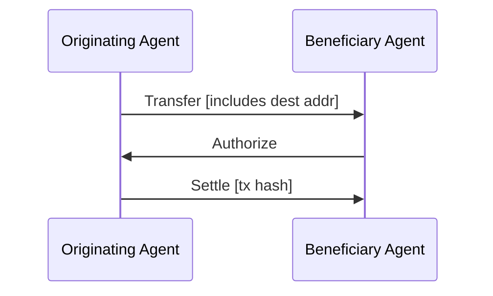
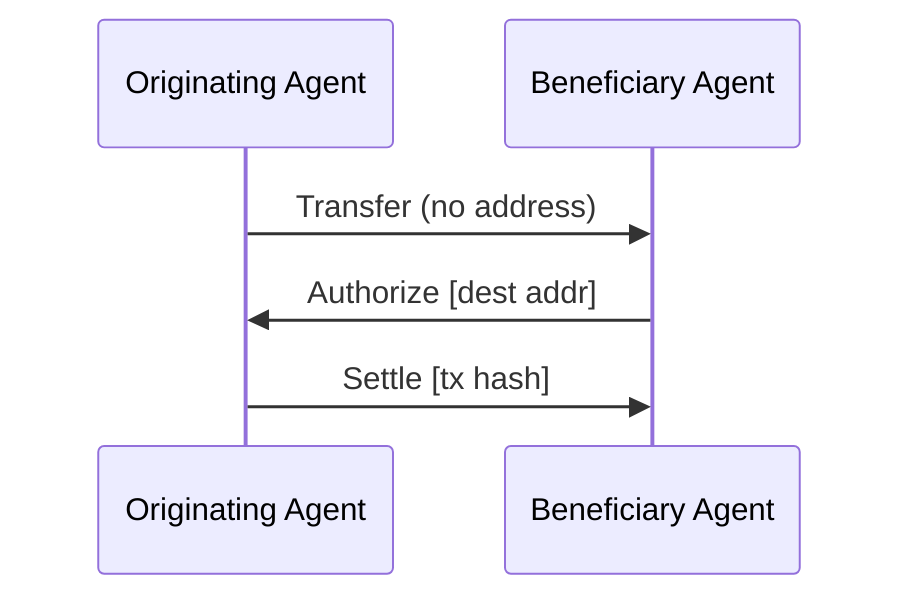
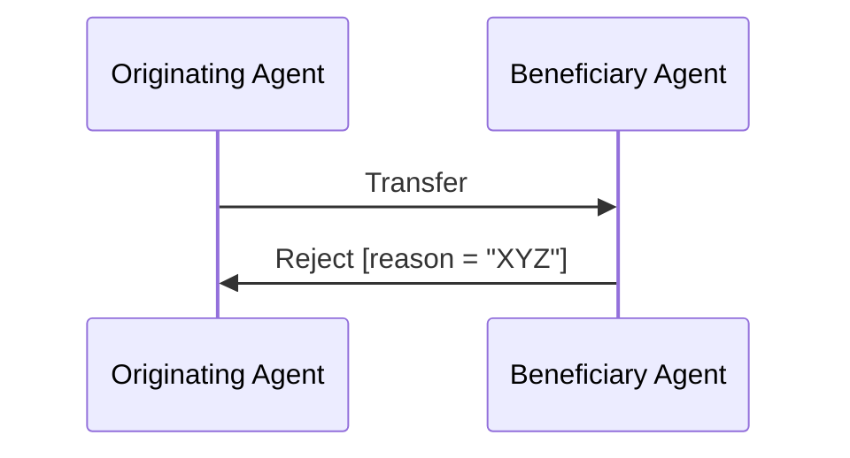
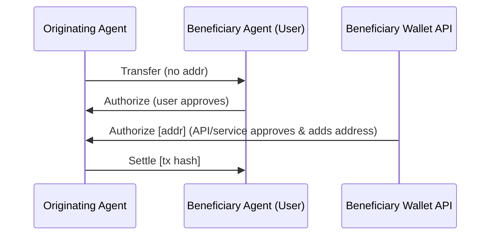

# Executive Overview

The **Transaction Authorization Protocol (TAP)** is a decentralized off-chain protocol that allows multiple participants in a blockchain transaction to identify each other and collaboratively authorize or reject the transaction before on-chain settlement ([GitHub - TransactionAuthorizationProtocol/TAIPs](https://github.com/TransactionAuthorizationProtocol/TAIPs#:~:text=,goal%20of%20authorizing%20them%20safely)). In essence, TAP creates an **authorization layer** atop the blockchain’s settlement layer ([TAIPs/TAIPs/taip-4.md at main · TransactionAuthorizationProtocol/TAIPs · GitHub](https://github.com/TransactionAuthorizationProtocol/TAIPs/blob/main/TAIPs/taip-4.md#:~:text=Authorization%20Protocol%20%28TAP%29%20and%20TAIP,permissionless%20aspects%20of%20blockchains%20today)). This enables counterparties (originators and beneficiaries, and their service providers) to coordinate safely and privately, solving real-world challenges like compliance, fraud prevention, and user experience without altering the underlying permissionless blockchain ([Transaction Authorization Protocol](https://tap.rsvp/TAIPs/taip-4#:~:text=Crypto%20transactions%20and%20blockchains%20are,and%20growth%20in%20the%20field)).

TAP’s core functionality is to introduce a **multi-party approval flow** for crypto transactions. Instead of unilateral transfers where only the sender’s key approval matters, TAP involves all relevant parties (and their agents) in the decision to execute a transaction ([Transaction Authorization Protocol](https://tap.rsvp/TAIPs/taip-4#:~:text=This%20specification%20defines%20the%20Transaction,of%20%204%20between%20Agents)) ([Transaction Authorization Protocol](https://tap.rsvp/TAIPs/taip-4#:~:text=Non)). Communication occurs through secure messages exchanging transaction details, identity information, and approvals. By doing so, TAP achieves several objectives:

- **Safety & Accuracy**: Ensures funds arrive at the correct destination by letting the beneficiary (receiver) or their agent confirm the destination address and approve the transaction *before* it’s broadcast ([Transaction Authorization Protocol](https://tap.rsvp/TAIPs/taip-4#:~:text=There%20are%20three%20primary%20actions,an%20agent%20can%20take)) ([Transaction Authorization Protocol](https://tap.rsvp/TAIPs/taip-4#:~:text=%2A%20%60%40context%60%20,all%20others%20it%20is%20OPTIONAL)). This can prevent mis-sent payments or high-risk transfers.
- **Compliance**: Allows parties to comply with regulations (e.g. the FATF Travel Rule) by privately exchanging required identity data off-chain between financial institutions (VASPs) ([TAP - The Transaction Authorization Protocol for public blockchains](https://tap.rsvp/#:~:text=Comply%20with%20latest%20regulations%20Comply,regulations%20without%20compromising%20user%20privacy)). This keeps sensitive user data off the public blockchain while still fulfilling compliance checks.
- **Better User Experience**: Replaces opaque blockchain addresses with recognizable identities and context. TAP messages can include real-world counterpart identities (names, profiles) and metadata (invoices, references) so that transactions are “between people/organizations” rather than random addresses ([TAP - The Transaction Authorization Protocol for public blockchains](https://tap.rsvp/#:~:text=Transactions%20between%20people%20rather%20than,cryptographic%20addresses)). This reduces errors and makes crypto payments feel more like traditional payments.
- **Privacy & Security**: All data exchange in TAP is end-to-end encrypted and only shared with authorized parties, preserving privacy ([TAP - The Transaction Authorization Protocol for public blockchains](https://tap.rsvp/#:~:text=Comply%20with%20latest%20regulations%20Comply,regulations%20without%20compromising%20user%20privacy)). TAP is **permissionless and open**, meaning no central gatekeeper – any wallet, exchange, or application can implement it to improve transaction safety ([TAP - The Transaction Authorization Protocol for public blockchains](https://tap.rsvp/#:~:text=No%20gatekeepers%2C%20no%20restrictions%2C%20no,limits)). Each message is cryptographically signed, ensuring authenticity and integrity (see Security Considerations).

Overall, TAP introduces a generic authorization *handshake* for transactions: one party initiates a transaction proposal, other parties (or their agents) approve or deny it, and finally the transaction is settled on-chain if approved ([TAIPs/TAIPs/taip-4.md at main · TransactionAuthorizationProtocol/TAIPs · GitHub](https://github.com/TransactionAuthorizationProtocol/TAIPs/blob/main/TAIPs/taip-4.md#:~:text=A%20simple%20generic%20transaction%20authorization,around%20authorizing%20or%20rejecting%20it)) ([Transaction Authorization Protocol](https://tap.rsvp/TAIPs/taip-4#:~:text=There%20are%20three%20primary%20actions,an%20agent%20can%20take)). This approach bridges the gap between real-world agreements and trustless blockchain execution, enabling safe and compliant crypto transactions across a range of use cases.

# Use Cases

TAP is designed to support a variety of real-world crypto transaction scenarios. The TAP whitepaper highlights several key use cases where a multi-party authorization protocol is beneficial:

- **Travel Rule Compliance (VASP-to-VASP transfers)** – When a user at one exchange (Originator VASP) sends crypto to a user at another exchange (Beneficiary VASP), TAP can carry the required originator/beneficiary identity information and confirm the beneficiary’s wallet address *before* on-chain settlement. Both institutions exchange messages to verify each other’s customers and regulatory data privately, complying with FATF Travel Rule requirements without exposing personal data on-chain ([TAP - The Transaction Authorization Protocol for public blockchains](https://tap.rsvp/#:~:text=Comply%20with%20latest%20regulations%20Comply,regulations%20without%20compromising%20user%20privacy)). This two-party authorization flow ensures the beneficiary exchange has vetted the incoming transfer and provided a valid destination address, reducing the risk of violations or misrouting funds.

- **Safer Custodial Withdrawals and Deposits** – In a withdrawal from a custodial wallet service (exchange or bank) to a self-hosted wallet, TAP allows the institution (Originator’s agent) to verify the beneficiary’s identity or intent. For example, the beneficiary (user’s personal wallet or another service) can send an **Authorize** message approving the withdrawal and confirming their address, giving the originator confidence to proceed. This *bidirectional* check prevents customers from accidentally withdrawing to the wrong address or sending funds to unverified parties. Conversely, for deposits, a user’s wallet can use TAP to query the receiving exchange for a confirmed deposit address and approval. This dramatically improves the safety and security of customer on-chain transactions ([TAP - The Transaction Authorization Protocol for public blockchains](https://tap.rsvp/#:~:text=Safer%20withdrawals%20and%20deposits%20Dramatically,chain%20transactions)).

- **Post-Trade Settlement** – In scenarios such as decentralized exchange (DEX) trades or OTC trades that involve a third-party custodian, TAP can coordinate the final **settlement**. For example, after a trade execution on a non-custodial platform, the buyer’s custodian and seller’s custodian use TAP to exchange **Transfer** details and ensure both approve the settlement *before* moving the assets. If the trade details match and both sides send **Authorize**, one custodian (or both) will then broadcast the on-chain transactions. This ensures that trades are settled securely and only when both parties (or their agents) are ready, preventing mistakes in delivering assets ([TAP - The Transaction Authorization Protocol for public blockchains](https://tap.rsvp/#:~:text=Post,party%20custodian)).

- **B2B Cross-Border Payments** – Businesses can use TAP to conduct cross-border payments with stablecoins or cryptocurrencies while tying the payment to invoices, customer references, or purchase orders. An originator company’s agent can initiate a **Transfer** message containing invoice numbers or customer IDs, and the beneficiary company’s agent can **Authorize** once they’ve verified the invoice details. Both companies exchange identity information (e.g. company DIDs, legal entity identifiers) and any required compliance info using TAP. This creates an instant, on-chain settled payment that still carries all necessary real-world context for accounting and compliance ([TAP - The Transaction Authorization Protocol for public blockchains](https://tap.rsvp/#:~:text=B2B%20Payments%20Instantly%20settled%20cross,invoices%20not%20opaque%20blockchain%20addresses)). TAP essentially enables crypto payments that integrate into existing business processes (invoice reconciliation, record-keeping) by sharing the metadata off-chain.

- **E-Commerce Payments** – When a customer pays an online merchant in crypto (e.g. using stablecoins), TAP can facilitate the exchange of order and identity details needed to complete the sale. The merchant’s payment gateway and the customer’s wallet (or their respective agents) use TAP messages to share the invoice or cart details, shipping address, and merchant’s receiving address privately ([TAP - The Transaction Authorization Protocol for public blockchains](https://tap.rsvp/#:~:text=E,commerce%20payments%20using%20stablecoins)). The customer’s wallet sends a **Transfer** request with the order ID and amount; the merchant’s agent checks that against the order and replies with **Authorize** (or **Reject** if something doesn’t match). Only then does the customer’s wallet finalize the payment on-chain. This flow ensures the merchant is ready to fulfill the order and that the payment includes the proper references, all without exposing sensitive info on the blockchain. It improves the user experience and trust in using stablecoins for e-commerce by mirroring the traditional payment authorization (where merchants approve a charge before it settles).

These use cases demonstrate TAP’s flexibility: it can be applied wherever an extra **layer of verification or data exchange** is needed around a crypto transaction. From compliance between institutions to consumer payments, TAP’s standard message flows enable parties to **privately share identities, confirm details, and mutually authorize** transactions in a structured way.

# Comprehensive Message Reference

TAP defines a small set of message types that cover the essential actions in an authorization flow ([Transaction Authorization Protocol](https://tap.rsvp/TAIPs/taip-4#:~:text=This%20specification%20defines%20the%20Transaction,of%20%204%20between%20Agents)). All TAP messages conform to the DIDComm v2 message structure (see next section) and use a defined JSON schema. Each message has a `type` URI in the TAP namespace (e.g. `https://tap.rsvp/schema/1.0#MessageType`) and carries a `body` with a context and specific fields for that message ([TAIPs/TAIPs/taip-2.md at main · TransactionAuthorizationProtocol/TAIPs · GitHub](https://github.com/TransactionAuthorizationProtocol/TAIPs/blob/main/TAIPs/taip-2.md#:~:text=The%20following%20attributes%20from%20DIDComm,are%20used%20in%20TAP)) ([Transaction Authorization Protocol](https://tap.rsvp/TAIPs/taip-4#:~:text=%7B%20%22from%22%3A%20%22did%3Aweb%3Abeneficiary.vasp%22%2C%20%22type%22%3A%20%22https%3A%2F%2Ftap.rsvp%2Fschema%2F1.0,Authorize%22%2C%20%22settlementAddress)). The **threading** mechanism of DIDComm is used: all messages in response to an initial transaction request include a `thid` (thread ID) referencing the original request’s ID ([Transaction Authorization Protocol](https://tap.rsvp/TAIPs/taip-4#:~:text=Messages%20implement%20TAIP,attribute%20of%20the%20message)) ([Transaction Authorization Protocol](https://tap.rsvp/TAIPs/taip-4#:~:text=There%20are%20three%20primary%20actions,an%20agent%20can%20take)). This links the conversation together.

The core TAP messages are as follows:

### **Transfer** (Transaction Request)  
This message initiates an authorization flow by describing the transaction that one party (the Originator) wants to perform. It’s typically sent by the Originating Agent to the Beneficiary Agent. The **Transfer** message contains the *who, what, and how* of the transaction. Its `body` includes fields defined in **TAIP-3 (Asset Transfer)** ([TAIPs/TAIPs/taip-3.md at main · TransactionAuthorizationProtocol/TAIPs · GitHub](https://github.com/TransactionAuthorizationProtocol/TAIPs/blob/main/TAIPs/taip-3.md#:~:text=This%20specification%20provides%20the%20messaging,a%20Transaction%20Authorization%20Protocol%20flow)) ([TAIPs/TAIPs/taip-3.md at main · TransactionAuthorizationProtocol/TAIPs · GitHub](https://github.com/TransactionAuthorizationProtocol/TAIPs/blob/main/TAIPs/taip-3.md#:~:text=%2A%20%60%40context%60%20,see%20%2072)):

- `@context` – JSON-LD context (set to `https://tap.rsvp/schema/1.0`) ([TAIPs/TAIPs/taip-3.md at main · TransactionAuthorizationProtocol/TAIPs · GitHub](https://github.com/TransactionAuthorizationProtocol/TAIPs/blob/main/TAIPs/taip-3.md#:~:text=%2A%20%60%40context%60%20,smallest%20subunit%20of%20a%20token)).
- `@type` – Message type, e.g. `https://tap.rsvp/schema/1.0#Transfer` ([TAIPs/TAIPs/taip-3.md at main · TransactionAuthorizationProtocol/TAIPs · GitHub](https://github.com/TransactionAuthorizationProtocol/TAIPs/blob/main/TAIPs/taip-3.md#:~:text=%2A%20%60%40context%60%20,aka%20the)).
- **Asset details**: 
  - `asset` – **Required.** A chain-agnostic asset identifier for the asset being transacted, using the CAIP-19 format (e.g. `eip155:1/slip44:60` for Ethereum mainnet ETH) ([TAIPs/TAIPs/taip-3.md at main · TransactionAuthorizationProtocol/TAIPs · GitHub](https://github.com/TransactionAuthorizationProtocol/TAIPs/blob/main/TAIPs/taip-3.md#:~:text=%2A%20%60%40type%60%20,aka%20the)).
  - `amountSubunits` – **Required for fungible tokens.** String representing the transfer amount in the smallest units of the asset (e.g. wei for ETH) ([TAIPs/TAIPs/taip-3.md at main · TransactionAuthorizationProtocol/TAIPs · GitHub](https://github.com/TransactionAuthorizationProtocol/TAIPs/blob/main/TAIPs/taip-3.md#:~:text=%2A%20%60asset%60%20,73%20identifier%20of%20the%20underlying)). For NFTs, this may be omitted or set appropriately (since the asset ID might uniquely identify the NFT). This field ensures no ambiguity in amount (it avoids decimal issues by using integer subunits ([TAIPs/TAIPs/taip-3.md at main · TransactionAuthorizationProtocol/TAIPs · GitHub](https://github.com/TransactionAuthorizationProtocol/TAIPs/blob/main/TAIPs/taip-3.md#:~:text=))).
- **Participants**:
  - `originator` – **Optional.** An object identifying the Originator Party (the sender) ([TAIPs/TAIPs/taip-3.md at main · TransactionAuthorizationProtocol/TAIPs · GitHub](https://github.com/TransactionAuthorizationProtocol/TAIPs/blob/main/TAIPs/taip-3.md#:~:text=Specified%20as%20a%20string%20with,220%20identifier%20of%20the%20underlying)). This typically includes an `@id` which is a DID or IRI for the originator (see TAIP-6, Transaction Parties) and can include additional metadata about the party.
  - `beneficiary` – **Optional.** An object identifying the Beneficiary Party (the recipient) ([TAIPs/TAIPs/taip-3.md at main · TransactionAuthorizationProtocol/TAIPs · GitHub](https://github.com/TransactionAuthorizationProtocol/TAIPs/blob/main/TAIPs/taip-3.md#:~:text=a%20token%20%2A%20%60originator%60%20,220%20identifier%20of%20the%20underlying)). Also expressed as a DID/IRI and optional metadata. Including originator/beneficiary details is useful for compliance (e.g. Travel Rule) or context (who the parties are), but in some cases the parties might be implicitly known or can be looked up via the agents’ relationship.
- `agents` – **Required.** An array of objects identifying the **Agent(s)** involved in executing this transaction ([TAIPs/TAIPs/taip-3.md at main · TransactionAuthorizationProtocol/TAIPs · GitHub](https://github.com/TransactionAuthorizationProtocol/TAIPs/blob/main/TAIPs/taip-3.md#:~:text=%2A%20%60beneficiary%60%20,5%20for%20more)). Each agent entry has an `@id` (DID of the agent) and optionally a `role` and a `for` attribute:
  - `role` – Role of this agent in the transaction, if applicable ([TAIPs/TAIPs/taip-5.md at main · TransactionAuthorizationProtocol/TAIPs · GitHub](https://github.com/TransactionAuthorizationProtocol/TAIPs/blob/main/TAIPs/taip-5.md#:~:text=The%20following%20are%20the%20attributes,array)) ([TAIPs/TAIPs/taip-3.md at main · TransactionAuthorizationProtocol/TAIPs · GitHub](https://github.com/TransactionAuthorizationProtocol/TAIPs/blob/main/TAIPs/taip-3.md#:~:text=Agents%20can%20have%20specific%20roles,the%20execution%20of%20a%20transaction)). For example, TAIP-3 defines roles like `"SettlementAddress"` (the agent providing a blockchain address for settlement) and `"SourceAddress"` (the agent providing the source of funds) ([TAIPs/TAIPs/taip-3.md at main · TransactionAuthorizationProtocol/TAIPs · GitHub](https://github.com/TransactionAuthorizationProtocol/TAIPs/blob/main/TAIPs/taip-3.md#:~:text=Agents%20can%20have%20specific%20roles,the%20execution%20of%20a%20transaction)). These roles clarify which agent will actually sign/send the on-chain transaction or receive funds.
  - `for` – If an agent is acting on behalf of another agent or party, this links to that entity’s DID ([TAIPs/TAIPs/taip-5.md at main · TransactionAuthorizationProtocol/TAIPs · GitHub](https://github.com/TransactionAuthorizationProtocol/TAIPs/blob/main/TAIPs/taip-5.md#:~:text=The%20following%20are%20the%20attributes,array)). For instance, a **custodial wallet service** agent might have `for: did:web:alice` (Alice’s DID) to show it represents Alice in this transfer.
  - `policies` – (Optional) An array of policy identifiers that the agent requires for this transaction ([TAIPs/TAIPs/taip-5.md at main · TransactionAuthorizationProtocol/TAIPs · GitHub](https://github.com/TransactionAuthorizationProtocol/TAIPs/blob/main/TAIPs/taip-5.md#:~:text=The%20following%20are%20the%20attributes,array)). Policies (defined in TAIP-7) could denote risk checks or compliance steps the agent enforces.
- `settlementAddress` – **Optional.** A blockchain address where the asset should be delivered. If the originator already knows a specific address for the beneficiary, they can include it here (formatted as CAIP-10 account ID, e.g. `eip155:1:0xabc...`) ([Transaction Authorization Protocol](https://tap.rsvp/TAIPs/taip-4#:~:text=%2A%20%60%40context%60%20,all%20others%20it%20is%20OPTIONAL)). Including the `settlementAddress` up front means the beneficiary’s agent does not need to reveal it later; excluding it means the beneficiary’s agent will provide it in an **Authorize** message if they approve.

The Transfer message is essentially a *proposal*: “I (originator) want to send X asset of Y amount from A to B, using these agents.” It contains enough information for the beneficiary side to evaluate the transaction (check amounts, parties, etc.) and decide how to respond. Many fields are optional to allow flexibility – for example, the originator may not initially include parties or may omit the settlement address, in which case those details can be filled in during the subsequent authorization process ([TAIPs/TAIPs/taip-3.md at main · TransactionAuthorizationProtocol/TAIPs · GitHub](https://github.com/TransactionAuthorizationProtocol/TAIPs/blob/main/TAIPs/taip-3.md#:~:text=help%20execute%20the%20transaction,5%20for%20more)). 

### **Authorize**  
An **Authorize** message is sent by any agent that approves the transaction. In practice, usually the Beneficiary’s agent(s) will reply with **Authorize** to indicate the transaction is acceptable on their side. Originator-side agents might also send an Authorize if they have internal policies that require separate approval steps (e.g., an exchange might require a second internal system to authorize high-value transfers). An Authorize message always references the original Transfer thread (`thid` pointing to the Transfer’s ID) ([Transaction Authorization Protocol](https://tap.rsvp/TAIPs/taip-4#:~:text=There%20are%20three%20primary%20actions,an%20agent%20can%20take)).

Key `body` fields for Authorize (defined in TAIP-4) include ([Transaction Authorization Protocol](https://tap.rsvp/TAIPs/taip-4#:~:text=Authorize)) ([Transaction Authorization Protocol](https://tap.rsvp/TAIPs/taip-4#:~:text=%2A%20%60settlementAddress%60%20,all%20others%20it%20is%20OPTIONAL)):

- `@context` – (Same context `https://tap.rsvp/schema/1.0`) ([Transaction Authorization Protocol](https://tap.rsvp/TAIPs/taip-4#:~:text=%2A%20%60%40context%60%20,all%20others%20it%20is%20OPTIONAL)).
- `@type` – `https://tap.rsvp/schema/1.0#Authorize` (identifies this as an Authorize message) ([Transaction Authorization Protocol](https://tap.rsvp/TAIPs/taip-4#:~:text=%2A%20%60%40context%60%20,all%20others%20it%20is%20OPTIONAL)).
- `settlementAddress` – **Optional.** The blockchain address to use for settlement. This field is crucial if the original Transfer did *not* specify a destination address ([Transaction Authorization Protocol](https://tap.rsvp/TAIPs/taip-4#:~:text=%28provisional%29%20%2A%20%60settlementAddress%60%20,all%20others%20it%20is%20OPTIONAL)). In that case, the Beneficiary’s agent **MUST** include a `settlementAddress` here (since the beneficiary is the one who knows where they want funds delivered). If the Transfer already had a `settlementAddress`, this field can be omitted in Authorize (or could be present but would typically match the same address). By deferring the address until authorization, TAP enables a beneficiary to **withhold their blockchain address until they approve** the transaction ([Transaction Authorization Protocol](https://tap.rsvp/TAIPs/taip-4#:~:text=TAP%20proposes%20a%20non,agents%20have%20mitigated%20sufficient%20risk)) ([Transaction Authorization Protocol](https://tap.rsvp/TAIPs/taip-4#:~:text=%28provisional%29%20%2A%20%60settlementAddress%60%20,all%20others%20it%20is%20OPTIONAL)) – a significant security improvement. For example, a compliance officer at the beneficiary institution might only provide the deposit address once they are satisfied the transaction meets their checks; without authorization, the originator cannot even send to them.

The Authorize message effectively says: “I approve this transaction (and here is the address to use, if not already given).” It is a green-light from one participant. Multiple agents can send Authorize in a given thread – e.g., if both a user’s wallet and a compliance service need to approve, each sends their own Authorize message. Each agent monitors the thread for Authorize messages from others. Importantly, **Authorize is not a final on-chain action**, just an off-chain approval. After receiving the necessary Authorize signals, an originator will proceed to **Settle** (broadcast the transaction).

Below is a simple two-party TAP flow where the originator provided the address initially (so Authorize contains no address). Then the originator proceeds to settle the transaction:



*Figure: Basic TAP flow with one originator agent and one beneficiary agent, where the destination address was included in the Transfer. The beneficiary simply authorizes, and then the originator settles on-chain ([Transaction Authorization Protocol](https://tap.rsvp/TAIPs/taip-4#:~:text=sequenceDiagram%20Participant%20Originating%20Agent%20Participant,Beneficiary%20Agent)).* 

If the originator’s Transfer **did not include** a settlement address, the flow involves the beneficiary providing it in their Authorize message:



*Figure: TAP flow where the beneficiary supplies the settlement address upon authorizing (originator didn’t have the address initially) ([Transaction Authorization Protocol](https://tap.rsvp/TAIPs/taip-4#:~:text=sequenceDiagram%20Participant%20Originating%20Agent%20Participant,Beneficiary%20Agent)). In both cases, the final **Settle** message indicates the transaction is being broadcast.* 

### **Settle**  
A **Settle** message is sent by the originator’s side when they are ready to execute (or have executed) the blockchain transaction. Typically the Originating Agent (e.g. an exchange) sends **Settle** to inform the beneficiary’s agent that “I am now settling this transfer on-chain.” This message can be used as a notification and to convey the on-chain transaction identifier. In some flows, an originator might wait for one or multiple Authorize messages before sending Settle.

Fields in a Settle message’s body (TAIP-4) include ([Transaction Authorization Protocol](https://tap.rsvp/TAIPs/taip-4#:~:text=An%20originating%20agent%20notifies%20the,object)) ([Transaction Authorization Protocol](https://tap.rsvp/TAIPs/taip-4#:~:text=%2A%20%60%40context%60%20,one%20agent%20representing%20the%20originator)):

- `@context` – `https://tap.rsvp/schema/1.0` (as usual) ([Transaction Authorization Protocol](https://tap.rsvp/TAIPs/taip-4#:~:text=%2A%20%60%40context%60%20,one%20agent%20representing%20the%20originator)).
- `@type` – `https://tap.rsvp/schema/1.0#Settle` ([Transaction Authorization Protocol](https://tap.rsvp/TAIPs/taip-4#:~:text=%2A%20%60%40context%60%20,one%20agent%20representing%20the%20originator)).
- `settlementId` – **Optional.** An identifier for the on-chain transaction that is being used to settle. This is typically the blockchain transaction hash (TXID) in a standardized format. TAP adopts a simplified version of the CAIP-220 format for transaction identifiers ([Transaction Authorization Protocol](https://tap.rsvp/TAIPs/taip-4#:~:text=%2A%20%60%40context%60%20,one%20agent%20representing%20the%20originator)) ([Transaction Authorization Protocol](https://tap.rsvp/TAIPs/taip-4#:~:text=)). For example, a settlementId could look like:  
  `eip155:1:tx/0x3edb98c24...7c33`  
  which encodes the chain (Ethereum mainnet, in CAIP-2 format `eip155:1`) and the transaction hash. If the Settle message is sent *before* the transaction is actually mined (as a heads-up), it may omit the `settlementId` initially, but at least one originator-side agent **must** send a Settle with the `settlementId` once known (so that the others have a record of the on-chain reference) ([Transaction Authorization Protocol](https://tap.rsvp/TAIPs/taip-4#:~:text=%2A%20%60%40type%60%20,one%20agent%20representing%20the%20originator)) ([Transaction Authorization Protocol](https://tap.rsvp/TAIPs/taip-4#:~:text=%2A%20%60settlementId%60%20,one%20agent%20representing%20the%20originator)). Often, the agent that actually broadcasts the transaction (e.g. the user’s wallet or an exchange’s wallet service) will include the `settlementId`.

A Settle message signals the conclusion of the TAP flow: the transaction is now moving to the blockchain. Upon receiving a Settle, other agents can mark the transaction as finalized (or wait for on-chain confirmation if needed). Multiple Settle messages can occur in complex scenarios (for instance, if both an exchange and its backend wallet service each send a Settle to confirm their actions – one might indicate “about to settle” and another with the actual hash, or if there are multiple legs to settlement). But in a simple case, one Settle from the originator is enough.

### **Reject**  
Any participant can send a **Reject** message to indicate the transaction should not proceed ([Transaction Authorization Protocol](https://tap.rsvp/TAIPs/taip-4#:~:text=There%20are%20three%20primary%20actions,an%20agent%20can%20take)) ([Transaction Authorization Protocol](https://tap.rsvp/TAIPs/taip-4#:~:text=Reject)). For example, a Beneficiary Agent might reject a Transfer if the details don’t match their expectations or policies (wrong amount, failed KYC, etc.), or an Originator Agent might reject after initially proposing if it detects new risk (perhaps the beneficiary’s provided address came out risky). A Reject message, like Authorize, is tied to the original Transfer thread.

Fields in Reject (TAIP-4) include ([Transaction Authorization Protocol](https://tap.rsvp/TAIPs/taip-4#:~:text=Any%20agent%20can%20always%20reject,party%20will%20comply%20with%20it)):

- `@context` – `https://tap.rsvp/schema/1.0` ([Transaction Authorization Protocol](https://tap.rsvp/TAIPs/taip-4#:~:text=%2A%20%60%40context%60%20,why%20the%20transaction%20was%20rejected)).
- `@type` – `https://tap.rsvp/schema/1.0#Reject` ([Transaction Authorization Protocol](https://tap.rsvp/TAIPs/taip-4#:~:text=%2A%20%60%40context%60%20,why%20the%20transaction%20was%20rejected)).
- `reason` – **Optional.** A human-readable string explaining why the transaction was rejected ([Transaction Authorization Protocol](https://tap.rsvp/TAIPs/taip-4#:~:text=%2A%20%60%40context%60%20,why%20the%20transaction%20was%20rejected)). This could be a short code or message (e.g., “Beneficiary name mismatch”, “Risk threshold exceeded”, “Unsupported asset”). The reason is not standardized by TAP itself, but provides insight for the counterparty to log or display.

Reject halts the authorization flow from that agent’s perspective. It does **not** automatically cancel the process for others – there is no global state – but it signals that this particular participant will not authorize. In practice, if any required participant rejects, the originator should abandon or restart the transaction with corrected info. 



*Figure: Example where the beneficiary’s agent rejects the proposed transfer ([Transaction Authorization Protocol](https://tap.rsvp/TAIPs/taip-4#:~:text=sequenceDiagram%20Participant%20Originating%20Agent%20Participant,Beneficiary%20Agent)). After a Reject, no on-chain settlement occurs unless the originator decides to try again with modifications.* 

Notably, TAP’s design allows even an originator to send a Reject **after** an Authorize was received ([Transaction Authorization Protocol](https://tap.rsvp/TAIPs/taip-4#:~:text=Originating%20Agent%20,Originating%20Agent%3A%20Reject)) ([Transaction Authorization Protocol](https://tap.rsvp/TAIPs/taip-4#:~:text=Originating%20Agent%20,Originating%20Agent%3A%20Reject)). For instance, the originator gets an Authorize with a settlement address, but then performs a risk check on that address (off-chain) and finds it unacceptable – the originator could then issue a Reject to abort the flow. Each agent is ultimately free to make the final call on whether to proceed or not, up until the transaction is actually settled.

### **Additional Protocol Messages** (Selective Disclosure & Proofs)  
While the above four messages (Transfer, Authorize, Settle, Reject) constitute the core of TAP’s transaction flow, the protocol can be extended with complementary messages for sharing additional data when needed:

- **Selective Disclosure Protocol (TAIP-8)** – Allows agents to share verifiable credentials or identity data about parties in a secure, controlled way ([TAIPs/TAIPs/taip-8.md at main · TransactionAuthorizationProtocol/TAIPs · GitHub](https://github.com/TransactionAuthorizationProtocol/TAIPs/blob/main/TAIPs/taip-8.md#:~:text=Simple%20Summary)). This isn’t a single message type but rather a mini-protocol that might involve a request and response message to convey credentials (for example, a Beneficiary agent could request the Originator’s proof of identity, or vice versa, and the other side can respond with a signed credential). TAP core messages intentionally avoid carrying sensitive personal data to protect privacy ([TAIPs/TAIPs/taip-6.md at main · TransactionAuthorizationProtocol/TAIPs · GitHub](https://github.com/TransactionAuthorizationProtocol/TAIPs/blob/main/TAIPs/taip-6.md#:~:text=Additional%20details%20can%20be%20submitted,8%20Selective%20Disclosure)). If such data (e.g., government ID, KYC info, travel rule info) is required, TAIP-8 defines how to do that via **verified credentials exchange** under the TAP context. This ensures compliance info is shared **only** when needed and in a privacy-preserving way (using W3C Verifiable Credentials/DIDComm attachments typically).

- **Proof of Relationship (TAIP-9)** – Defines a method for proving relationships between transaction participants ([TAIPs/TAIPs/taip-9.md at main · TransactionAuthorizationProtocol/TAIPs · GitHub](https://github.com/TransactionAuthorizationProtocol/TAIPs/blob/main/TAIPs/taip-9.md#:~:text=Simple%20Summary)). For example, an agent might need to prove that two parties have an established relationship (customer of a business, or two addresses belong to the same owner) before a high-value transaction is authorized. TAIP-9 likely involves messages where one party presents cryptographic proof or attestations of a relationship (such as a reference to a prior transaction or a shared membership in some group). This can build trust between participants by not just sharing static credentials, but proving dynamic relationships relevant to the transaction.

Developers integrating TAP should primarily implement the **core four messages (Transfer, Authorize, Settle, Reject)**. The additional protocols (TAIP-8, TAIP-9, etc.) are optional and used in specialized scenarios – they can be layered in as needed. All messages adhere to the common envelope defined by DIDComm v2 and TAP’s JSON-LD schemas. The TAP GitHub repository provides the full schemas and examples for each message type ([Transaction Authorization Protocol](https://tap.rsvp/TAIPs/taip-4#:~:text=Authorize)) ([Transaction Authorization Protocol](https://tap.rsvp/TAIPs/taip-4#:~:text=Settle)). By following these specs, different systems (wallets, exchanges, etc.) can interoperate seamlessly in the authorization flows.

To illustrate a more complex flow, consider a scenario with **multiple agents**: suppose a beneficiary user has their own wallet app (Beneficiary Agent) and that wallet app’s provider offers an API service (Beneficiary WalletAPI) that also needs to authorize (for additional security). Both are involved in the TAP flow, along with the originator. The sequence might look like:



*Figure: Multi-agent authorization. Here the Beneficiary has two agents who each send an Authorize in sequence ([Transaction Authorization Protocol](https://tap.rsvp/TAIPs/taip-4#:~:text=sequenceDiagram%20Participant%20Originating%20Agent%20Participant,Beneficiary%20WalletAPI%20Participant%20Beneficiary%20Agent)). The first authorize might represent the user’s consent, and the second from an automated service attaches the destination address once all checks pass. Finally, the originator settles the transaction.* 

TAP allows such multi-party negotiation flexibly – agents can send messages in any order (non-deterministic flow) until the transaction is either authorized by all or someone rejects ([Transaction Authorization Protocol](https://tap.rsvp/TAIPs/taip-4#:~:text=Non)). The protocol only defines the message types and threading; it does not impose a strict sequence beyond the requirement that they all refer to the initial Transfer thread.

# DIDComm v2 and DID Standards Overview

TAP is built on decentralized identity standards, which provide the secure communication and identification backbone for the protocol. This section gives a brief overview of **DIDComm v2** (the messaging protocol used) and the **Decentralized Identifier (DID)** standards that underpin TAP’s identification of parties and agents.

### DIDComm v2 in TAP

[DIDComm v2](https://identity.foundation/didcomm-messaging/spec/) is a secure message protocol developed by the Decentralized Identity Foundation. It enables private, authenticated, end-to-end encrypted messaging between parties that are identified by DIDs (decentralized identifiers). TAP uses DIDComm v2 as the primary communication method for all its protocol messages ([TAIPs/TAIPs/taip-2.md at main · TransactionAuthorizationProtocol/TAIPs · GitHub](https://github.com/TransactionAuthorizationProtocol/TAIPs/blob/main/TAIPs/taip-2.md#:~:text=TAIP,within%20the%20context%20of%20TAP)). By leveraging DIDComm, TAP messages inherit a number of important features:

- **Standard Message Structure**: DIDComm defines a JSON-based message format with common headers (`id`, `type`, `from`, `to`, etc.) ([TAIPs/TAIPs/taip-2.md at main · TransactionAuthorizationProtocol/TAIPs · GitHub](https://github.com/TransactionAuthorizationProtocol/TAIPs/blob/main/TAIPs/taip-2.md#:~:text=The%20following%20attributes%20from%20DIDComm,are%20used%20in%20TAP)). TAP adheres to this, meaning each TAP message is a DIDComm **plaintext message** with a unique `id`, a `type` URI (pointing to the TAP message schema as discussed), `from` and `to` fields containing the DIDs of the sender and recipients, and so on ([TAIPs/TAIPs/taip-2.md at main · TransactionAuthorizationProtocol/TAIPs · GitHub](https://github.com/TransactionAuthorizationProtocol/TAIPs/blob/main/TAIPs/taip-2.md#:~:text=The%20following%20attributes%20from%20DIDComm,are%20used%20in%20TAP)). The TAP specification sets specific requirements on these fields (e.g., use of `thid` for threading, as noted). For example, a DIDComm message in TAP will look like:  
  ```json
  {
    "id": "12345-67890-abcd",
    "type": "https://tap.rsvp/schema/1.0#Transfer",
    "from": "did:web:originator.example",
    "to": ["did:web:beneficiary.example"],
    "created_time": 1678901234,
    "body": { ... } 
  }
  ```  
  This envelope is then signed/encrypted as needed (see security below). Using DIDComm ensures **transport independence** – the message can be sent via HTTP, email, WebSocket, etc., because the content is self-contained and addressed by DIDs rather than any network-specific addresses ([TAIPs/TAIPs/taip-2.md at main · TransactionAuthorizationProtocol/TAIPs · GitHub](https://github.com/TransactionAuthorizationProtocol/TAIPs/blob/main/TAIPs/taip-2.md#:~:text=TAIP,within%20the%20context%20of%20TAP)).

- **Security (Encryption & Signatures)**: DIDComm supports flexible security layers: plaintext (no crypto, just JSON), signed, and encrypted messages ([TAIPs/TAIPs/taip-2.md at main · TransactionAuthorizationProtocol/TAIPs · GitHub](https://github.com/TransactionAuthorizationProtocol/TAIPs/blob/main/TAIPs/taip-2.md#:~:text=The%20following%20shows%20a%20minimal,Plaintext%20Message%20following%20DIDComm%20spec)) ([TAIPs/TAIPs/taip-2.md at main · TransactionAuthorizationProtocol/TAIPs · GitHub](https://github.com/TransactionAuthorizationProtocol/TAIPs/blob/main/TAIPs/taip-2.md#:~:text=Security%20Concerns)). TAP mandates that all messages must be **signed** by the sender’s private key (using JSON Web Signatures - JWS) ([TAIPs/TAIPs/taip-2.md at main · TransactionAuthorizationProtocol/TAIPs · GitHub](https://github.com/TransactionAuthorizationProtocol/TAIPs/blob/main/TAIPs/taip-2.md#:~:text=Message%20Signing)). This provides authentication and integrity – the receiver can verify the message’s `from` DID truly sent it by checking the signature against the DID’s public keys. In addition, TAP messages can be **encrypted** (using JSON Web Encryption - JWE) for confidentiality ([TAIPs/TAIPs/taip-2.md at main · TransactionAuthorizationProtocol/TAIPs · GitHub](https://github.com/TransactionAuthorizationProtocol/TAIPs/blob/main/TAIPs/taip-2.md#:~:text=transport%20level%20encryption,specified%20in%20DIDComm%20Encrypted%20Messages)). Typically, DIDComm encryption is done using the receiver’s public key from their DID Document, ensuring only the intended recipients can read the content ([TAIPs/TAIPs/taip-2.md at main · TransactionAuthorizationProtocol/TAIPs · GitHub](https://github.com/TransactionAuthorizationProtocol/TAIPs/blob/main/TAIPs/taip-2.md#:~:text=transport%20level%20encryption,specified%20in%20DIDComm%20Encrypted%20Messages)). In practice, TAP often runs over already secure channels (like HTTPS between known servers), but end-to-end encryption adds an extra layer especially if using intermediaries or storing messages. The combination of DIDComm+JWS/JWE means TAP messages have similar security to secure email or messaging: signed and optionally encrypted data packets ([TAIPs/TAIPs/taip-2.md at main · TransactionAuthorizationProtocol/TAIPs · GitHub](https://github.com/TransactionAuthorizationProtocol/TAIPs/blob/main/TAIPs/taip-2.md#:~:text=,the%20TAP%20decentralized%20messaging%20standard)) ([TAIPs/TAIPs/taip-2.md at main · TransactionAuthorizationProtocol/TAIPs · GitHub](https://github.com/TransactionAuthorizationProtocol/TAIPs/blob/main/TAIPs/taip-2.md#:~:text=Test%20Cases)).

- **Decentralization & Peer-to-Peer**: DIDComm does not rely on a central server or intermediary. TAP participants exchange DIDComm messages directly (peer-to-peer or through agreed transport routes). This fits TAP’s decentralized ethos: any two agents with each other’s DID can start a TAP communication. There’s no central TAP server or blockchain required for the messaging itself – the blockchain is only the settlement layer. This decentralization is critical for privacy and resiliency ([TAIPs/TAIPs/taip-2.md at main · TransactionAuthorizationProtocol/TAIPs · GitHub](https://github.com/TransactionAuthorizationProtocol/TAIPs/blob/main/TAIPs/taip-2.md#:~:text=This%20TAIP%20is%20based%20on,it%20is%20never%20a%20requirement)) ([TAIPs/TAIPs/taip-2.md at main · TransactionAuthorizationProtocol/TAIPs · GitHub](https://github.com/TransactionAuthorizationProtocol/TAIPs/blob/main/TAIPs/taip-2.md#:~:text=,the%20TAP%20decentralized%20messaging%20standard)). It also means that **routing** of messages is flexible – e.g., DIDs often include a service endpoint (in the DID Document) that tells others how to send them DIDComm messages (could be an HTTPS endpoint, DIDComm Mediator, etc.). As a developer, you can use existing DIDComm v2 libraries to handle packing/unpacking of messages, signature verification, encryption, and routing.

For further reading on DIDComm v2, see the official DIDComm v2 Specification ([TAIPs/TAIPs/taip-2.md at main · TransactionAuthorizationProtocol/TAIPs · GitHub](https://github.com/TransactionAuthorizationProtocol/TAIPs/blob/main/TAIPs/taip-2.md#:~:text=TAIP,within%20the%20context%20of%20TAP)) and the DIDComm documentation by DIF. These cover the protocol in depth, including how DID exchange works, routing (DID service endpoints or peer DIDs), message threading, etc. TAP uses a straightforward DIDComm usage: assume a secure connection or known DID exchange has happened out-of-band, then send TAP messages as DIDComm **signed envelopes**.

### Decentralized Identifiers (DIDs) and DID Standards

**Decentralized Identifiers (DIDs)** are globally unique identifiers that are controlled by the subject (owner) independent of any central authority ([TAIPs/TAIPs/taip-5.md at main · TransactionAuthorizationProtocol/TAIPs · GitHub](https://github.com/TransactionAuthorizationProtocol/TAIPs/blob/main/TAIPs/taip-5.md#:~:text=Agents%20are%20identified%20using%20Decentralized,LD%20node%20syntax)). A DID looks like `did:<method>:<unique-string>`. For example, `did:web:mybank.com` is a DID using the `web` method (which ties a DID to a domain), and `did:pkh:eip155:1:0xABC...` is a DID using the `pkh` (public key hash) method (tying a DID to a blockchain address on Ethereum). 

In TAP, every **Agent** is identified by a DID, and Parties can also be identified by DIDs (or other IRIs) ([TAIPs/TAIPs/taip-5.md at main · TransactionAuthorizationProtocol/TAIPs · GitHub](https://github.com/TransactionAuthorizationProtocol/TAIPs/blob/main/TAIPs/taip-5.md#:~:text=Representing%20Agents)) ([TAIPs/TAIPs/taip-6.md at main · TransactionAuthorizationProtocol/TAIPs · GitHub](https://github.com/TransactionAuthorizationProtocol/TAIPs/blob/main/TAIPs/taip-6.md#:~:text=Parties%20are%20identified%20using%20an,decentralized%20manner%2C%20are%20also%20recommended)). This allows each participant to have a cryptographic identity that can be looked up and verified. The **DID Document** associated with a DID contains public keys and service endpoints for that DID ([TAIPs/TAIPs/taip-5.md at main · TransactionAuthorizationProtocol/TAIPs · GitHub](https://github.com/TransactionAuthorizationProtocol/TAIPs/blob/main/TAIPs/taip-5.md#:~:text=Representing%20Agents)) ([TAIPs/TAIPs/taip-5.md at main · TransactionAuthorizationProtocol/TAIPs · GitHub](https://github.com/TransactionAuthorizationProtocol/TAIPs/blob/main/TAIPs/taip-5.md#:~:text=Agents%20are%20identified%20using%20Decentralized,LD%20node%20syntax)). For instance, the DID Document for `did:web:originator.example` might have the originator’s public signing key and an endpoint (URL) where it can receive DIDComm messages. When an agent receives a TAP message from a DID, it uses DID resolution to fetch the sender’s DID Document and verify the signature with the public key (ensuring the message really came from that DID) ([TAIPs/TAIPs/taip-2.md at main · TransactionAuthorizationProtocol/TAIPs · GitHub](https://github.com/TransactionAuthorizationProtocol/TAIPs/blob/main/TAIPs/taip-2.md#:~:text=%2A%20%60created_time%60%20,the%20message%20after%20this%20time)). Similarly, to send an encrypted response, it would use the recipient’s public key from their DID Document.

TAP builds on the existing **DID standards**: the [W3C DID Core specification](https://www.w3.org/TR/did-core/) defines the DID syntax, the concept of DID Documents, and the data model ([TAIPs/TAIPs/taip-6.md at main · TransactionAuthorizationProtocol/TAIPs · GitHub](https://github.com/TransactionAuthorizationProtocol/TAIPs/blob/main/TAIPs/taip-6.md#:~:text=Parties%20are%20identified%20using%20an,decentralized%20manner%2C%20are%20also%20recommended)) ([TAIPs/TAIPs/taip-6.md at main · TransactionAuthorizationProtocol/TAIPs · GitHub](https://github.com/TransactionAuthorizationProtocol/TAIPs/blob/main/TAIPs/taip-6.md#:~:text=numbers%20www.rfc,decentralized%20manner%2C%20are%20also%20recommended)). Many different **DID methods** exist (did:web, did:key, did:ethr, did:ion, etc.), and TAP doesn’t mandate a particular method – whatever suits the agents. Common methods used in TAP examples include:

- `did:web`: DIDs that are linked to web domains. For example, a VASP (exchange) might use `did:web:exchange.com` as its DID, hosting the DID Document on its website. This leverages the existing DNS/HTTPS infrastructure for trust (you trust that domain = that entity). In TAP examples, institutions often use `did:web` ([TAIPs/TAIPs/taip-5.md at main · TransactionAuthorizationProtocol/TAIPs · GitHub](https://github.com/TransactionAuthorizationProtocol/TAIPs/blob/main/TAIPs/taip-5.md#:~:text=%7B%20)).
- `did:pkh`: DIDs derived from blockchain addresses (as per CAIP-10). For example, `did:pkh:eip155:1:0x1234...` is essentially a DID representing the Ethereum address 0x1234... on mainnet ([TAIPs/TAIPs/taip-5.md at main · TransactionAuthorizationProtocol/TAIPs · GitHub](https://github.com/TransactionAuthorizationProtocol/TAIPs/blob/main/TAIPs/taip-5.md#:~:text=%7B%20%22from%22%3A%22did%3Aweb%3Aoriginator.sample%22%2C%20%22type%22%3A%20%22https%3A%2F%2Ftap.rsvp%2Fschema%2F1.0,Transfer%22%2C%20%22asset%22%3A%20%22eip155%3A1%2Fslip44%3A60)). Self-hosted wallets or individual users might use this to identify themselves by their wallet address in a standard way. In TAP, you might see a user’s wallet agent have a did:pkh DID (since their identity is basically their address in that context).
- Others like `did:key` (a self-contained DID based on a public key) or `did:ion` (decentralized DID on Bitcoin via Sidetree) could also be used. The key requirement is that the DID method supports public keys and service endpoints so that DIDComm can be performed.

**DIDComm and DIDs Together**: When starting a TAP exchange, an agent will know the DID of the counterparty’s agent (e.g., via an introduction, configuration, or directory). It uses that DID to encrypt messages to them and to address the message (`to` field). The receiving agent sees the sender’s DID in the `from` field and verifies the signature using the DID Document. Thus, trust in TAP flows comes down to trust in the DIDs: each party should verify they’re talking to the correct DID (e.g., `did:web:beneficiarybank.com` should indeed belong to the actual beneficiary’s bank). This might involve out-of-band verification like checking the DID’s domain or having pre-established connections.

**DID Standards References**: Developers may refer to the W3C DID Core spec ([TAIPs/TAIPs/taip-6.md at main · TransactionAuthorizationProtocol/TAIPs · GitHub](https://github.com/TransactionAuthorizationProtocol/TAIPs/blob/main/TAIPs/taip-6.md#:~:text=Parties%20are%20identified%20using%20an,decentralized%20manner%2C%20are%20also%20recommended)) for understanding DIDs and DID Documents, and the emerging DID methods specifications (many are W3C DID Method Registry entries or separate specs). Additionally, the JSON-LD context used in TAP (`https://tap.rsvp/schema/1.0`) builds on Linked Data principles – TAP message bodies are expressed in JSON-LD for extensibility ([TAIPs/TAIPs/taip-3.md at main · TransactionAuthorizationProtocol/TAIPs · GitHub](https://github.com/TransactionAuthorizationProtocol/TAIPs/blob/main/TAIPs/taip-3.md#:~:text=As%20specified%20in%20TAIP,The%20following%20attributes%20are%20defined)). This means the schemas can interoperate with other linked data vocabularies. For example, one could include a context for LEI (Legal Entity Identifier) and add an `leiCode` field to a Party object to convey a company’s LEI ([TAIPs/TAIPs/taip-6.md at main · TransactionAuthorizationProtocol/TAIPs · GitHub](https://github.com/TransactionAuthorizationProtocol/TAIPs/blob/main/TAIPs/taip-6.md#:~:text=As%20an%20example%20you%20could,of%20a%20party%20like%20this)). The use of JSON-LD is aligned with DID standards and allows linking out to other standards as needed.

**In summary**, TAP’s use of DIDComm v2 and DIDs provides a modern, secure infrastructure:
- DIDComm v2 gives confidential, authenticated messaging without central servers ([TAIPs/TAIPs/taip-2.md at main · TransactionAuthorizationProtocol/TAIPs · GitHub](https://github.com/TransactionAuthorizationProtocol/TAIPs/blob/main/TAIPs/taip-2.md#:~:text=TAP%20messages%20should%20adhere%20to,privacy%2C%20decentralization%2C%20and%20transport%20independence)) ([TAIPs/TAIPs/taip-2.md at main · TransactionAuthorizationProtocol/TAIPs · GitHub](https://github.com/TransactionAuthorizationProtocol/TAIPs/blob/main/TAIPs/taip-2.md#:~:text=This%20TAIP%20is%20based%20on,it%20is%20never%20a%20requirement)).
- DIDs give each participant a self-sovereign identity, with verifiable keys and endpoints ([TAIPs/TAIPs/taip-5.md at main · TransactionAuthorizationProtocol/TAIPs · GitHub](https://github.com/TransactionAuthorizationProtocol/TAIPs/blob/main/TAIPs/taip-5.md#:~:text=Agents%20are%20identified%20using%20Decentralized,LD%20node%20syntax)).
- Standard specs (DID Core, DIDComm spec) ensure TAP implementations are compatible with existing SSI (Self-Sovereign Identity) tooling. For further exploration, see the DIDComm spec ([TAIPs/TAIPs/taip-2.md at main · TransactionAuthorizationProtocol/TAIPs · GitHub](https://github.com/TransactionAuthorizationProtocol/TAIPs/blob/main/TAIPs/taip-2.md#:~:text=TAIP,within%20the%20context%20of%20TAP)) and W3C DID Core ([TAIPs/TAIPs/taip-6.md at main · TransactionAuthorizationProtocol/TAIPs · GitHub](https://github.com/TransactionAuthorizationProtocol/TAIPs/blob/main/TAIPs/taip-6.md#:~:text=Parties%20are%20identified%20using%20an,decentralized%20manner%2C%20are%20also%20recommended)), as well as related standards like JSON Web Signatures (RFC 7515) ([TAIPs/TAIPs/taip-2.md at main · TransactionAuthorizationProtocol/TAIPs · GitHub](https://github.com/TransactionAuthorizationProtocol/TAIPs/blob/main/TAIPs/taip-2.md#:~:text=Message%20Signing)) and JSON Web Encryption (RFC 7516) which are used under the hood.

# Security Considerations

TAP is designed with security and privacy as top priorities, given it coordinates potentially sensitive pre-transaction information. This section outlines the key security aspects of TAP, potential threats, and how they are mitigated:

- **Authenticity and Integrity of Messages**: Every TAP message is required to be signed using the sender’s DID private key (JWS signature) ([TAIPs/TAIPs/taip-2.md at main · TransactionAuthorizationProtocol/TAIPs · GitHub](https://github.com/TransactionAuthorizationProtocol/TAIPs/blob/main/TAIPs/taip-2.md#:~:text=Message%20Signing)). This means recipients can **verify the sender’s identity** and detect any tampering. If a malicious actor attempted to alter a message in transit or inject a false message, the signature check would fail. Agents must only accept messages from DIDs that are part of the transaction flow (e.g., listed in the `agents` array or known via out-of-band agreement) ([Transaction Authorization Protocol](https://tap.rsvp/TAIPs/taip-4#:~:text=It%20is%20always%20the%20responsibility,part%20of%20a%20transaction%20flow)). For example, if a Transfer lists agent DIDs A and B, and suddenly an unknown DID C sends an Authorize, B should ignore it. Each agent should *verify the sender is an expected participant* before acting on a message ([Transaction Authorization Protocol](https://tap.rsvp/TAIPs/taip-4#:~:text=It%20is%20always%20the%20responsibility,part%20of%20a%20transaction%20flow)). Uniqueness of message `id` and thread IDs also helps prevent replay attacks – a message replayed with the same `id` would be recognized as duplicate, and if an attacker tried to reuse a message in a different context, the DIDs and thread wouldn’t match.

- **Confidentiality**: TAP messages can be end-to-end encrypted (DIDComm encryption) so that only intended recipients can read them ([TAIPs/TAIPs/taip-2.md at main · TransactionAuthorizationProtocol/TAIPs · GitHub](https://github.com/TransactionAuthorizationProtocol/TAIPs/blob/main/TAIPs/taip-2.md#:~:text=transport%20level%20encryption,specified%20in%20DIDComm%20Encrypted%20Messages)). This is important when messages contain sensitive details like personal data or private crypto addresses. Even though TAP runs off-chain, if it’s sent over the public internet, encryption prevents eavesdroppers from learning transaction details or PII. Implementations should use DIDComm’s encryption (JWE) with strong algorithms (Anoncrypt or Authcrypt with elliptic curve keys, typically) ([TAIPs/TAIPs/taip-2.md at main · TransactionAuthorizationProtocol/TAIPs · GitHub](https://github.com/TransactionAuthorizationProtocol/TAIPs/blob/main/TAIPs/taip-2.md#:~:text=transport%20level%20encryption,specified%20in%20DIDComm%20Encrypted%20Messages)) ([TAIPs/TAIPs/taip-2.md at main · TransactionAuthorizationProtocol/TAIPs · GitHub](https://github.com/TransactionAuthorizationProtocol/TAIPs/blob/main/TAIPs/taip-2.md#:~:text=,the%20TAP%20decentralized%20messaging%20standard)). In addition, **transport-level security** (TLS) is recommended for the channels used (HTTPS, etc.). Thus, TAP can achieve **defense in depth**: encrypted payload over an encrypted channel. The DIDComm spec and underlying JOSE standards ensure modern cryptographic security.

- **Participant Authentication (DID Trust)**: The security of TAP heavily relies on the trust in DIDs. Agents should use **trusted DID methods** and exchange DIDs or DID Documents through authentic channels beforehand. For instance, an exchange might publish its DID on its website or share it via an API. If using `did:web`, the authenticity ties back to the DNS certificate of the domain. If using `did:pkh`, trust might derive from the blockchain address (perhaps verified via an on-chain registry or prior knowledge). A threat here would be an attacker impersonating another by using a look-alike DID. Mitigation: maintain an allow-list of partner DIDs (especially for institutional use), or use verifiable credentials to identify DIDs (e.g., a VASP could present a credential that binds their DID to their legal entity). Once the correct DID is known, the cryptographic signatures guarantee that messages truly come from the holder of that DID. **Impersonation** is thus thwarted by a combination of out-of-band DID verification and in-band signature checking.

- **Privacy & Data Minimization**: TAP is built to minimize sharing of personally identifiable information (PII) unless absolutely necessary. The main TAP flow (Transfer/Authorize/etc.) deals primarily with transaction metadata (amount, asset, DIDs, blockchain addresses) which are either public or pseudonymous ([Transaction Authorization Protocol](https://tap.rsvp/TAIPs/taip-4#:~:text=Privacy%20Considerations)). For example, a customer’s name or ID is not embedded in a Transfer message – instead, a DID is used to represent them. Any additional KYC data can be requested via selective disclosure (TAIP-8) which is a separate, controlled exchange ([TAIPs/TAIPs/taip-6.md at main · TransactionAuthorizationProtocol/TAIPs · GitHub](https://github.com/TransactionAuthorizationProtocol/TAIPs/blob/main/TAIPs/taip-6.md#:~:text=Additional%20details%20can%20be%20submitted,8%20Selective%20Disclosure)). This separation mitigates the risk of leaking sensitive info. Even the blockchain addresses, which could be considered personal data in context, can be abstracted: a beneficiary could choose to use an omnibus address (not unique per customer) to avoid correlating that address to a specific person ([Transaction Authorization Protocol](https://tap.rsvp/TAIPs/taip-4#:~:text=Privacy%20Considerations)). TAP’s privacy model assumes participants will share private data only over encrypted channels and on a need-to-know basis. Another consideration is **data retention**: since TAP messages are off-chain, participants should securely store or discard them per their privacy policies. There is no public ledger of these messages, which is good for privacy, but means each party is responsible for handling the data ethically and securely.

- **No Shared Global State**: TAP deliberately does *not* rely on a shared ledger or central server for state ([Transaction Authorization Protocol](https://tap.rsvp/TAIPs/taip-4#:~:text=It%20is%20essential%20to%20understand,ultimate%20settlement%20on%20a%20blockchain)) ([Transaction Authorization Protocol](https://tap.rsvp/TAIPs/taip-4#:~:text=Transaction%20State%20from%20the%20point,of%20view%20of%20various%20agents)). Each agent maintains its own view of the transaction’s state (proposed, authorized, settled, etc.). The lack of shared state avoids any single point of failure or attack, but it means **consensus is achieved through the message exchange itself**. A consequence is that each agent should implement robust logic to handle different sequences of events. For example, it’s possible in a multi-agent scenario that one agent authorizes while another rejects – each agent must decide how to proceed (likely, if any Reject is seen, they treat the transaction as rejected). There’s a potential threat if an agent incorrectly assumes consensus when not all parties agreed. Mitigation is largely by design: TAP’s non-deterministic flow and game-theoretic incentives ensure that if an agent cares about a condition, it will wait to see the appropriate message before proceeding ([Transaction Authorization Protocol](https://tap.rsvp/TAIPs/taip-4#:~:text=TAP%20proposes%20a%20non,agents%20have%20mitigated%20sufficient%20risk)). E.g., an originator will not send Settle until it has all required Authorize messages (by its own policy), and a beneficiary will not provide an address or will refuse to settle on-chain unless its conditions are met. The **policy framework (TAIP-7)** lets each agent configure what it requires (multiple authorizations, specific proofs, etc.), so that they only act (or ultimately sign the on-chain transaction) when those are satisfied.

- **Fraud and Abuse Mitigations**: TAP enhances security by enabling checks that were previously not possible in pure on-chain flows. For instance, **address verification** is a big improvement – the beneficiary’s agent can ensure the originator uses the *correct* address that belongs to the beneficiary, mitigating man-in-the-middle attacks where an address could be swapped in a phishing scam. Also, through the `reason` field in Reject and similar, agents can communicate why something was refused, which could help in auditing and improving fraud detection rules. If a malicious actor tries to constantly initiate bogus transfers or spams messages, standard DIDComm and agent-level security can limit that (e.g., rate limiting, requiring an existing relationship or DID exchange before accepting messages). Since TAP is off-chain, spam or abuse doesn’t incur on-chain fees but can be managed by agent software policies.

- **Mitigating Race Conditions and Finality**: Blockchain transactions are irreversible once confirmed. TAP’s coordinated authorization is intended to catch issues *before* irreversible actions happen. One subtle issue could be if multiple authorizations come in at different times or someone changes their mind. Because an originator could technically broadcast a transaction at any time (they control the keys), TAP cannot absolutely prevent an originator from sending a transaction that wasn’t authorized by others – but if they do so, they break the off-chain agreement and risk consequences (possibly legal or relationship-wise). In practice, participants that adopt TAP will make it policy to only send transactions that went through TAP. The **game theory** mentioned in the spec is important: for example, a beneficiary institution might **withhold the actual crypto address until authorization** ([Transaction Authorization Protocol](https://tap.rsvp/TAIPs/taip-4#:~:text=counterparties%20to%20help%20them%20implement,agents%20have%20mitigated%20sufficient%20risk)) ([Transaction Authorization Protocol](https://tap.rsvp/TAIPs/taip-4#:~:text=withholding%20settlement%20or%20not%20sharing,agents%20have%20mitigated%20sufficient%20risk)). That way, the originator *cannot* even attempt to settle to the beneficiary without the beneficiary’s consent. On the flip side, once the beneficiary does provide the address via Authorize, they are signaling they’re ready to receive funds. If at that point the originator doesn’t send the funds (e.g., they disappear or reject after getting address), the beneficiary hasn’t lost funds – they just didn’t gain anything, and could choose not to do business with that originator again. The originator, meanwhile, if they don’t settle after everyone authorized, risks reputational damage or breach of any off-chain contract. Thus, TAP relies on incentives and possibly legal agreements between parties to enforce that once you commit to Authorize, you expect the transaction to happen, and if you commit to transfer, you won’t back out arbitrarily.

- **Threat: Compromised Agent or Key** – If one agent’s keys are compromised, an attacker could send false Authorize/Reject messages or read confidential data. This is a general threat to any PKI system. Mitigations include: using DID rotation (DID documents can be updated to revoke old keys), monitoring for suspicious messages, and possibly requiring multi-signature approvals (e.g., two different agents must Authorize, so one compromised agent alone can’t authorize a transaction). Agents (like exchanges) should secure their private keys in hardware security modules (HSMs) or other secure enclaves. If a user’s personal agent (wallet) is compromised, that’s akin to their wallet being hacked – TAP can’t directly fix that, but it limits blast radius by involving other agents (for example, an exchange might not accept just the user’s compromised wallet authorize; it might also require the exchange’s own risk engine to authorize).

In summary, TAP’s security model builds on strong cryptographic primitives (DIDComm’s encryption/signature), decentralized identity trust, and prudent protocol design (explicit approvals, ability to negotiate, and no action until all conditions met). Each party is responsible for validating every piece of information – *trust but verify*. As the spec states: **“It is always the responsibility of each agent to verify the contents of each message before acting on it.”** ([Transaction Authorization Protocol](https://tap.rsvp/TAIPs/taip-4#:~:text=Security%20Considerations)). By following the protocol and using the provided mechanisms, developers can ensure that a Transaction Authorization Protocol implementation significantly reduces the risks of fraud, errors, and regulatory non-compliance in blockchain transactions, while preserving the core security of the underlying blockchain. 

**Sources:**

- Transaction Authorization Protocol – *TAP Whitepaper & Spec* ([GitHub - TransactionAuthorizationProtocol/TAIPs](https://github.com/TransactionAuthorizationProtocol/TAIPs#:~:text=,goal%20of%20authorizing%20them%20safely)) ([Transaction Authorization Protocol](https://tap.rsvp/TAIPs/taip-4#:~:text=A%20simple%20generic%20transaction%20authorization,around%20authorizing%20or%20rejecting%20it)) ([Transaction Authorization Protocol](https://tap.rsvp/TAIPs/taip-4#:~:text=There%20are%20three%20primary%20actions,an%20agent%20can%20take)) ([Transaction Authorization Protocol](https://tap.rsvp/TAIPs/taip-4#:~:text=It%20is%20always%20the%20responsibility,part%20of%20a%20transaction%20flow))  
- TAP Improvement Proposals (TAIPs) – *Messaging (TAIP-2), Asset Transfer (TAIP-3), Protocol (TAIP-4), Agents (TAIP-5), Parties (TAIP-6), etc.* ([TAIPs/TAIPs/taip-2.md at main · TransactionAuthorizationProtocol/TAIPs · GitHub](https://github.com/TransactionAuthorizationProtocol/TAIPs/blob/main/TAIPs/taip-2.md#:~:text=TAIP,within%20the%20context%20of%20TAP)) ([TAIPs/TAIPs/taip-3.md at main · TransactionAuthorizationProtocol/TAIPs · GitHub](https://github.com/TransactionAuthorizationProtocol/TAIPs/blob/main/TAIPs/taip-3.md#:~:text=%2A%20%60%40context%60%20,see%20%2072)) ([TAIPs/TAIPs/taip-5.md at main · TransactionAuthorizationProtocol/TAIPs · GitHub](https://github.com/TransactionAuthorizationProtocol/TAIPs/blob/main/TAIPs/taip-5.md#:~:text=Agents%20are%20identified%20using%20Decentralized,LD%20node%20syntax)) ([TAIPs/TAIPs/taip-6.md at main · TransactionAuthorizationProtocol/TAIPs · GitHub](https://github.com/TransactionAuthorizationProtocol/TAIPs/blob/main/TAIPs/taip-6.md#:~:text=Parties%20are%20identified%20using%20an,decentralized%20manner%2C%20are%20also%20recommended))  
- DIDComm v2 Specification – *DIF (Decentralized Identity Foundation)* ([TAIPs/TAIPs/taip-2.md at main · TransactionAuthorizationProtocol/TAIPs · GitHub](https://github.com/TransactionAuthorizationProtocol/TAIPs/blob/main/TAIPs/taip-2.md#:~:text=TAP%20messages%20should%20adhere%20to,privacy%2C%20decentralization%2C%20and%20transport%20independence)) ([TAIPs/TAIPs/taip-2.md at main · TransactionAuthorizationProtocol/TAIPs · GitHub](https://github.com/TransactionAuthorizationProtocol/TAIPs/blob/main/TAIPs/taip-2.md#:~:text=,the%20TAP%20decentralized%20messaging%20standard))  
- W3C Decentralized Identifiers (DID) Core Specification ([TAIPs/TAIPs/taip-6.md at main · TransactionAuthorizationProtocol/TAIPs · GitHub](https://github.com/TransactionAuthorizationProtocol/TAIPs/blob/main/TAIPs/taip-6.md#:~:text=Parties%20are%20identified%20using%20an,decentralized%20manner%2C%20are%20also%20recommended))